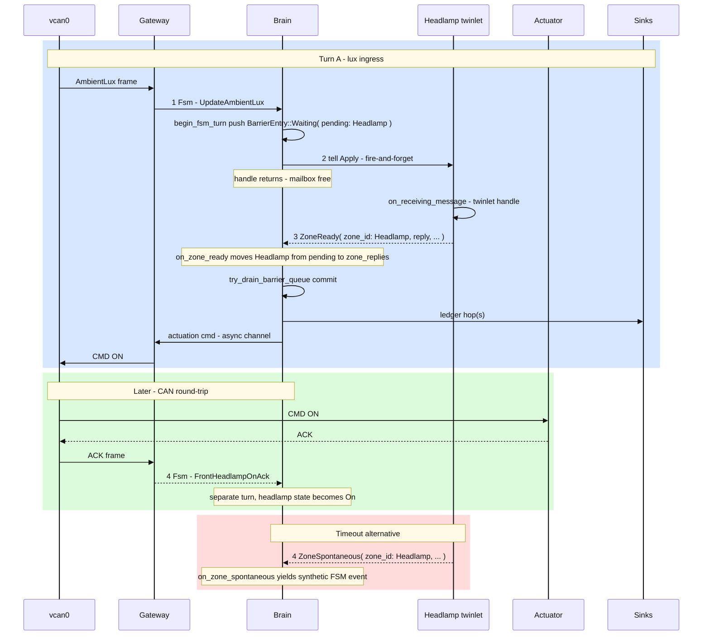
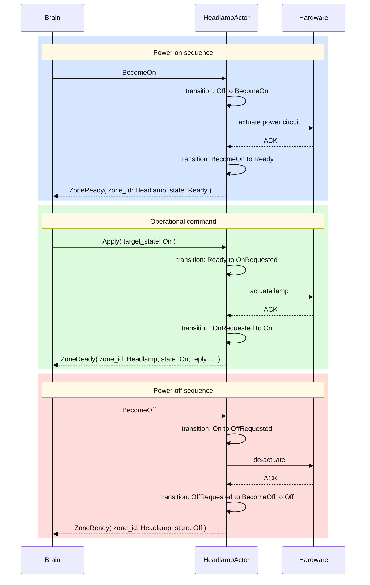
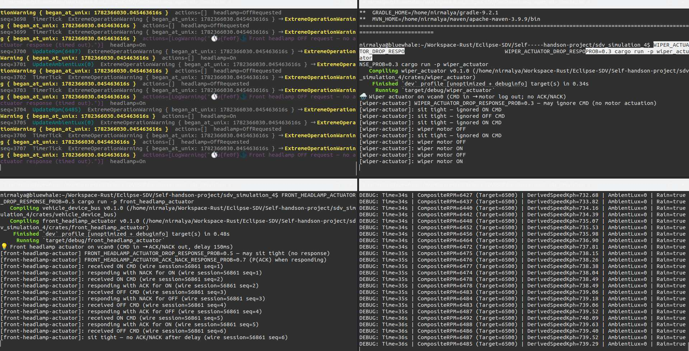

# SDV Simulation 4 — Brain FSM Redesign & Actorified Assembly Twinlets

---

↩️ This repo is **Iteration 4** of a software-defined-vehicle (#SDV) prototype. Each iteration
**grows on its predecessor** — reusing and refactoring what still fits, and changing structure
where the next goal requires it.

| Iteration | Repository                                                          | Focus                                                                                                             |
| --------- | ------------------------------------------------------------------- | ----------------------------------------------------------------------------------------------------------------- |
| 1         | [`sdv_simulation_1`](https://github.com/nsengupta/sdv_simulation_1) | First working CAN control loop                                                                                    |
| 2         | [`sdv_simulation_2`](https://github.com/nsengupta/sdv_simulation_2) | Assembly-based zone contexts, transition ledger, diagnostics                                                      |
| 3         | [`sdv_simulation_3`](https://github.com/nsengupta/sdv_simulation_3) | Headlamp twinlet (first actorified assembly), quiescent commit                                                    |
| **4**     | **`sdv_simulation_4` (this repo)**                                  | **Brain FSM Redesign** — start/stop barriers, generic assembly envelopes, ROB turn queue, second assembly (Wiper) |

---

## What This Iteration Is About

Iteration 4 completes the **Brain FSM Redesign**. The central goal was to replace the
Iteration-3 monolithic `handle()` — which had 5 match arms and a fragile
`Option<PendingBrainTurn>` — with a clean **`VecDeque<BarrierEntry>` drain loop**, a
**re-order buffer (ROB)** pattern that decouples assembly tell-back arrival order from event
ingress order.

### Why a TurnBarrier?

The Brain actor's mailbox receives both of:

1. External events, coming from Controller, viz., `PowerOn`, `RainsStarted` etc.
2. Conversational events, coming from the Assemblies, viz., `ZoneReady(Headlamp)`

In Iteration 3, each CAN ingress produced a *single* pending turn. If two events - say, 
HeadLampOn arrived while the first was still awaiting a headlamp tell-back, the second was stuffed into a
`VecDeque` backlog. When replies arrived out of order (e.g. event B's reply arrived before
event A's), the ledger recorded them in arrival order, violating causal consistency.

**`TurnBarrier`** solves this: every ingress event gets its own barrier pushed onto a
`VecDeque<BarrierEntry>`. Each barrier tracks which assemblies (`BTreeSet<AssemblyId>`) must
reply before it can commit. The drain loop inspects only the **front** entry: if its
`pending` set is non-empty, the loop stalls; once empty (or if the entry is `Passthrough`),
it pops and commits. This guarantees that the ledger records events in ingress order
regardless of reply arrival order.

### Why `PreparingToStart` / `PreparingToStop`?

Iteration 3 had no formal power-cycle protocol: `IgnitionOffReset` was handled speculatively
in the actor code. The new FSM introduces two explicit preparing states:

- **`PreparingToStart(BTreeSet<AssemblyId>)`** — entered on `PowerOn`. The Brain emits
  `StartAssemblies` domain actions (→ `BecomeOn` tells to each assembly) and counts down
  `AssemblyZoneReady` acknowledgements. When the set empties, the FSM transitions to `Idle`.
- **`PreparingToStop(BTreeSet<AssemblyId>)`** — entered on `PowerOff` from `Idle`. Symmetric
  shutdown: emit `StopAssemblies` (→ `BecomeOff` tells to each assembly), count down 
  acknowledgements, then transition to `Off`.

The `BTreeSet<AssemblyId>` embedded in the state variant is the **sole authoritative
countdown** — no duplicate state in `VehicleContext`.

### Improvements over Iteration 3

- **ROB ordering**: The `VecDeque<BarrierEntry>` drain loop guarantees causal consistency
  regardless of assembly reply arrival order. Event ingress order is the ledger order.
- **Generic assembly envelopes**: Mailbox variants `ZoneReady { zone_id, reply }` and
  `ZoneSpontaneous { zone_id, event }` replace headlamp-specific `HeadlampZoneReady` /
  `HeadlampZoneSpontaneous`. Adding a new assembly (Wiper) requires zero new `handle()` arms.
- **FSM-driven lifecycle**: `StartAssemblies` / `StopAssemblies` domain actions are emitted
  by `output()` on entry to preparing states, replacing the old manual `BecomeOn`/`BecomeOff`
  wiring in tests.
- **Per-assembly retry**: `ZoneTellBackTimeout { zone_id, turn_id, tell_attempt }` retries
  each unresponsive assembly independently, rather than a single `TellBackTimeout { turn_id }`
  that retried all zones at once.
- **Second assembly (Wiper)**: `AssemblyId::Wiper` is now defined alongside `Headlamp` in
  `ALL_ASSEMBLIES`. Wiper is a fully actorified twinlet with immediate transitions (no ACK protocol).
- **`PendingBrainTurn` deleted**: The old enum and its special-case handling are fully absorbed
  into the ROB pattern.
- **Brain Actor's `handle()` arms**: Exactly 4 arms — `Fsm`, `ZoneReady`,
  `ZoneTellBackTimeout`, `GetStatus`. Zero new arms per new assembly.

---

## Vocabulary

Terms used throughout this README.

| Term            | Meaning                                                                                                                                                                                                        |
| --------------- | -------------------------------------------------------------------------------------------------------------------------------------------------------------------------------------------------------------- |
| **Assembly**    | A managed device group identified by `AssemblyId` (`Headlamp`, `Wiper`). Each assembly has a lifecycle (`<BecomeOn>` → `Ready` → … → `<BecomeOff>` → `Off`) and a `{Assembly}Context` in `VehicleContext`.     |
| **Twinlet**     | One assembly as a **child actor** under the BrainTwin (mailbox + timers).                                                                                                                                      |
| **Brain**       | The digital twin overall — parent actor (`VirtualCarActor`), quiescent commit, ledger, actuation. State: `DigitalTwinCar`.                                                                                     |
| **Zone**        | SDV industry term for a vehicle concern. The mailbox vocabulary uses `ZoneReady` / `ZoneReply` / `ZoneSpontaneousEvent` as generic envelopes — these are **not** the internal tracking type (`AssemblyId` is). |
| **Tell**        | Brain → twinlet; **fire-and-forget** (mailbox free until tell-back or timeout).                                                                                                                                |
| **Tell-back**   | Twinlet → Brain reply (`turn_id`, `tell_attempt`; e.g. `ZoneReady { zone_id: Headlamp, … }`).                                                                                                                  |
| **Spontaneous** | Twinlet tell-back on its **own deadline** (e.g. ACK timer), not a new CAN ingress.                                                                                                                             |
| **Cut**         | Snapshot `(FsmState, VehicleContext)` at one instant.                                                                                                                                                          |
| **Quiescence**  | Multi-hop resolve to a **stable cut**; one ledger row per hop; one `apply_step`.                                                                                                                               |
| **ROB**         | Re-order buffer (`VecDeque<BarrierEntry>`) — preserves event ingress order regardless of assembly reply arrival order.                                                                                         |
| **TurnBarrier** | One per ingress event: tracks which assemblies have replied, holds per-assembly timers and replies.                                                                                                            |
| **Pyramid**     | Layered modules in `common` (**L0**–**L6**, physics up to gateway/actuator binaries); acyclic imports.                                                                                                         |

---

## Brain FSM States

The Brain's operational FSM governs the Digital Twin's mode. All 7 states:

```
Off ──PowerOn──► PreparingToStart({Headlamp, Wiper})
                       │ each AssemblyZoneReady(id) removes id
                       ▼
                PreparingToStart({Wiper})
                       │ AssemblyZoneReady(Wiper) → set empty
                       ▼
                     Idle ──UpdateRpm > threshold──► Driving
                       │                                  │
                 PowerOff                           stationary
                       │                                  │
                       ▼                                  ▼
           PreparingToStop({Headlamp, Wiper})           Idle
                       │ symmetric to start
                       ▼
                      Off

  Driving ──Internal(LightingUnsafe)──► DrivingDangerously
  DrivingDangerously ──headlamp On or lux high or stationary──► Driving or Idle
  Driving ──speed > 160 km/h──► ExtremeOperationWarning(now) ──TimerTick + cooldown──► Driving
```

Full transition table: [`diagrams/brain_transitions.md`](diagrams/brain_transitions.md)

### Key invariants

- `transition()` is a **pure function** — no I/O, no actor, no heap allocation or discovery
  of runtime resources. It receives only `(old_state, event, ctx)` and returns
  `(new_state, maybe_error)`. All side effects (timers, tells, ledger writes) are driven by
  the caller from the returned state.
- `output()` is a **pure function** — maps `(old_state, new_state, ctx)` to `Vec<FsmAction>`.
- Both are called exactly once per event, in strict order, from the actor's `handle()` thread.
- Execution of `tansition()` and `output()` is always single-threaded.
- The `BTreeSet<AssemblyId>` inside `PreparingToStart` / `PreparingToStop` is the **sole
  authoritative countdown** while waiting for responses from all the assemblies that the brain has. 
  Each `AssemblyZoneReady(id)` event removes that `id` from the set. When the set becomes empty, the transition function maps to `Idle` (start) or `Off`
  (stop). No separate `remaining_assemblies` field exists in `VehicleContext`.
- External events that arrive **during** a preparing state are recorded in the ledger with
  `applied: false` and discarded — they are never replayed. Events that arrive **after** the
  FSM has reached `Idle` are processed according to their semantic meaning (e.g. `UpdateRpm`
  may transition to `Driving`).
- `PowerOff` is **rejected** (logged) in `Driving`, `DrivingDangerously`, `ExtremeOperationWarning`,
  or `Off`.
- Every power cycle goes through a preparing state — never `Off ↔ Idle` directly.

---

## Assembly lifecycle

Each assembly transitions independently through its own internal FSM, driven by
`BecomeOn` / `BecomeOff` tells from the Brain during `PreparingToStart` /
`PreparingToStop`. The assembly acknowledges readiness via
`AssemblyZoneReady(AssemblyId)` tell-backs. **Internal states differ by assembly** —
headlamp and wiper are documented separately below.

### Headlamp assembly FSM

Lux thresholding and hardware `AckOn` / `AckOff` intermediates:

```
Off ──BecomeOn──► Ready ──lux≤threshold──► OnRequested ──AckOn──► On
▲                    ▲    ◄──ActIncompl(On)/Timeout──              │
│                    │                                             │ BecomeOff
│                    │                                             ▼
│                    │◄──────────── AckOff ────────────────── OffRequested
│                    │                                               │
│                    └──────── BecomeOff ────────────────────────────┘
└────────────────────────── BecomeOff ───────────────────────────────┘
```

**Events** (messages from Brain):

- **`BecomeOn`** — Brain tell: power up the assembly lifecycle.
- **`BecomeOff`** — Brain tell: power down the assembly lifecycle.

**States:**

- **Off** — Initial; no actuation. Ignores all zone messages except `BecomeOn`/`BecomeOff`.
- **Ready** — Idle but powered; awaiting lux threshold command.
- **OnRequested** — ON actuation sent to hardware; awaiting `AckOn`.
- **On** — Physical lamp confirmed ON by hardware ACK.
- **OffRequested** — OFF actuation sent to hardware; awaiting `AckOff`.

Full diagram: [`diagrams/headlamp_assembly_state_transition.md`](diagrams/headlamp_assembly_state_transition.md)

### Wiper assembly FSM

Wiper uses a simpler three-state model (`Off` / `Ready` / `Running`) with no lux gate and
no ACK intermediates — see [`diagrams/wiper_assembly_state_transition.md`](diagrams/wiper_assembly_state_transition.md).

---

## Architecture (L0–L6 Pyramid)

The `common` crate follows an acyclic layer pyramid. The critical invariant:
**L2 (`fsm`) must not import L3 or above**.

```
L0  vehicle_physics          Constants, pure kinematics (no FSM, no I/O)
L1  vehicle_state            Assemblies: powertrain, health, visibility, headlamp, wiper
L2  fsm                      FsmState, FsmEvent, step(), transition_map — pure decision core
L3  digital_twin, published  Twin capsule (DigitalTwinCar), serializable ledger projection
L4  twin_runtime, sinks      VirtualCarActor, HeadlampActor, WiperActor, turn_barrier, detectors
L5  facade                   Public surface — the only module gateway binaries may import
L6  gateway, emulator,       Application binaries — never import internal modules
    front_headlamp_actuator, wiper_actuator
```

Detail: [`docs/library-reorg.md`](docs/library-reorg.md)

---

## Brain Architecture (VirtualCarActor)

```text
DigitalTwinCarVocabulary (mailbox)
├── Fsm(FsmEvent)                         ← CAN ingress / detector events
├── ZoneReady { zone_id, turn_id, reply } ← twinlet tell-back (correlated)
├── ZoneSpontaneous { zone_id, event }    ← twinlet tell-back (unsolicited)
├── ZoneTellBackTimeout { zone_id, … }    ← per-assembly retry deadline
└── GetStatus(RpcReplyPort<CarSnapshot>)  ← synchronous snapshot query

VirtualCarActor (Brain)
├── barrier_queue: VecDeque<BarrierEntry>  ← ROB (Waiting / Passthrough variants)
│   └── TurnBarrier                        ← per-assembly pending set + timers + replies
├── on_zone_ready()                       ← matches barrier by turn_id
├── on_zone_timeout()                     ← per-assembly retry or synthetic reply
├── on_zone_spontaneous()                 ← unsolicited twinlet event
├── begin_fsm_turn()                      ← pushes barrier, tells assembly(ies)
└── try_drain_barrier_queue()             ← commits completed barriers front-to-back
```

### Tell / tell-back flow



---

## Assembly Architecture (Twinlets)

Both managed assemblies run as child actors under the Brain: `HeadlampActor` and
`WiperActor`. They share the same tell / tell-back envelope (`ZoneReady`) but differ in
whether operational transitions wait for hardware ACK.

### HeadlampActor

Headlamp models a full actuation round-trip: intermediate `OnRequested` / `OffRequested`
states, an ACK timer, and spontaneous `ZoneSpontaneous` events on deadline expiry.

```text
HeadlampActorMsg (mailbox)
├── Apply(BrainTurn)                      ← Brain tell: apply new state
├── BecomeOn                              ← Brain tell: power up lifecycle
├── BecomeOff                             ← Brain tell: power down lifecycle
└── Internal(FrontHeadlampOnAck)          ← actuator ACK (spontaneous)

HeadlampActor
├── ctx: HeadlampContext                  ← domain state
├── state_machine: AssemblyStateMachine   ← assembly lifecycle FSM
├── ack_timer: Option<JoinHandle<...>>    ← ACK deadline timer
├── on_receiving_message()               ← match on Apply / BecomeOn / BecomeOff
└── send_to_brain()                       ← tell-back ZoneReady / ZoneSpontaneous
```

#### Headlamp lifecycle flow



### WiperActor

Wiper is a fully actorified twinlet with **immediate transitions** and **no ACK protocol**.
Rain ingress (`RainsStarted` / `RainsStopped`, projected from `VssSignal::RainDetected` on
CAN) is routed to the wiper zone while the Brain is in `Idle` or `Driving`. A successful
`Start` / `Stop` tell emits `StartWiping` / `StopWiping` outcomes that traverse the
actuation path to `ActuationCommand::StartWiper` / `StopWiper` on CAN.

```text
WiperActorMsg (mailbox)
└── Apply(WiperActorVocabulary)           ← Brain tell: one WiperMessage per turn

WiperActor
├── ctx: WiperContext                     ← domain state (Off / Ready / Running)
├── on_receiving_message()                ← pure L1 handler; immediate ZoneReady reply
└── tell-back ZoneReady                   ← no spontaneous events, no ACK timer
```

- **Three states only** — `Off`, `Ready`, `Running`; no `OnRequested`-style pending states.
- **Tell-back timeout** still applies (Brain↔twinlet coordination). Exhaustion yields a
  synthetic `LogWarning` outcome on the diagnostic stream (unlike headlamp, there is no
  `ZoneSpontaneous` path).
- **L6 path** — gateway wiper command publisher → `vcan0` → `wiper_actuator` binary
  (fire-and-forget motor log; optional `WIPER_ACTUATOR_DROP_RESPONSE_PROB` to ignore CMDs).

Full diagram: [`diagrams/wiper_assembly_state_transition.md`](diagrams/wiper_assembly_state_transition.md)

---

## TurnBarrier — ROB Pattern

Each external ingress or twinlet spontaneous event creates one `TurnBarrier` wrapped in
`BarrierEntry` and pushed onto `barrier_queue`. The drain loop commits barriers **strictly in
ingress order**, regardless of which assembly replies arrive first.

```rust
pub(crate) struct TurnBarrier {
    turn_id:        u64,
    event:          FsmEvent,
    now:            Instant,

    pending:        BTreeSet<AssemblyId>,       // assemblies not yet replied
    zone_waits:     HashMap<AssemblyId, TellBackWait>,
    zone_timers:    HashMap<AssemblyId, TellBackTimer>,
    zone_replies:   HashMap<AssemblyId, ZoneReply>,
    zone_messages:  HashMap<AssemblyId, ZoneMessage>,
}

pub(crate) enum BarrierEntry {
    Waiting(TurnBarrier),                     // awaiting one or more assembly tell-backs
    Passthrough(PassthroughBarrier),          // no zone tell needed; committable immediately
}
```

**Drain invariant:** `while let Some(front) = barrier_queue.front()` — examine front entry;
if `Waiting` with non-empty `pending` set, stop; if `Passthrough` or `Waiting` with empty
`pending`, pop and commit. Only the front entry may be committed.

This solves the **ordering problem** from Iteration 3: when two assembly-directed events
arrive, then assembly replies arrive in reverse order (e.g. Wiper replies before Headlamp
replies to event A), the ledger still records event A before event B.

---

## Assembly Routing During Preparing States

The routing function `zone_message_for_event` returns `None` for all external events during
`PreparingToStart` / `PreparingToStop`. No tell is sent. The event is recorded in the ledger
with `applied: false` and discarded. Events that arrive after the FSM reaches `Idle` are
routed normally according to their semantic meaning.

---

## Quiescent Commit

One external ingress or twinlet message triggers **one quiescent commit**: the Brain runs
0+ **hops** (each → one ledger row), then `apply_step` once on the final stable cut, then
merged actuation.

```text
tell-back / ingress -> hop -> hop -> ... -> stable -> apply_step -> actuation
                        |-- one ledger row per hop --|
```

Detectors (e.g. `LightingUnsafe`) are pure functions in `twin_runtime/detectors/`. They
propose `FsmEvent::Internal(...)` events; the transition table decides. The loop terminates
when no detector fires or `MAX_QUIESCENCE_HOPS` is reached.

---

## How to Run

**Four processes** share Linux **SocketCAN** (`vcan0` by default). Start the actuators before
or alongside the gateway so CMD frames have a listener on the bus.

```bash
# One-time setup (per boot)
sudo modprobe vcan
sudo ip link add dev vcan0 type vcan 2>/dev/null || true
sudo ip link set up vcan0

# Terminal 1 — CAN emulator (RPM + ambient lux + rain sensor)
cargo run -p emulator

# Terminal 2 — Headlamp actuator (CMD in → ACK/NACK out)
cargo run -p front_headlamp_actuator

# Terminal 3 — Wiper actuator (CMD in → motor log out; no ACK/NACK)
cargo run -p wiper_actuator

# Terminal 4 — Gateway (Brain + HeadlampActor + WiperActor)
cargo run -p gateway

# Optional: coloured transition ledger only (no diagnostics)
cargo run -p gateway -- --print-transitions-only
```

### Tunable probabilities (optional)

| Variable                                     | Process                 | Effect                                                               |
| -------------------------------------------- | ----------------------- | -------------------------------------------------------------------- |
| `EMULATOR_TUNNEL_PROB`                       | emulator                | Per-tick probability of entering a low-lux tunnel (headlamp demo)    |
| `EMULATOR_RAIN_PROB`                         | emulator                | Per-tick probability of rain starting when dry (`0.0` disables rain) |
| `FRONT_HEADLAMP_ACTUATOR_DROP_RESPONSE_PROB` | front_headlamp_actuator | Probability of sending no ACK/NACK after a CMD                       |
| `WIPER_ACTUATOR_DROP_RESPONSE_PROB`          | wiper_actuator          | Probability of ignoring a wiper CMD (no motor actuation)             |

Example:

```bash
EMULATOR_RAIN_PROB=0.05 cargo run -p emulator
WIPER_ACTUATOR_DROP_RESPONSE_PROB=0.3 cargo run -p wiper_actuator
```

### Prerequisites

- Linux with `vcan0` set up (see one-time setup above)
- Rust toolchain (MSRV: latest stable)

---

## Project Structure

Detail: [`docs/project-structure.md`](docs/project-structure.md)

---

## Tests

```bash
# Run all tests
cargo test -p common

# Run specific contract suites
cargo test -p common -- test::quiescence_actor_contract
cargo test -p common -- test::zone_tell_back_contract
cargo test -p common -- test::turn_barrier_contract
cargo test -p common -- test::headlamp_ack_timer_contract
cargo test -p common -- test::headlamp_lifecycle_contract
cargo test -p common -- test::wiper_zone_contract
cargo test -p common -- test::wiper_actuation_contract
cargo test -p common -- test::wiper_signal_contract
cargo test -p common -- test::wiper_startup_failure_contract

# Wiper CAN codec (vehicle_device_bus)
cargo test -p vehicle_device_bus --test wiper_can_codec
```

Contract test reference: [`docs/contract-tests.md`](docs/contract-tests.md)

---
### Screenshot of running application




## Design Documents

Detail: [`docs/design-documents.md`](docs/design-documents.md)

---

## What Iteration 4 Is *Not* (Yet)

- Not a full vehicle SDV stack — two managed assemblies (`Headlamp`, `Wiper`) with L6 CAN
  slices; many other vehicle domains are absent.
- Not production safety certification — the correctness model is a teaching scaffold.
- Not the offline ledger analyser — the gateway can emit a machine-oriented transition stream;
  the reader/report tool is designed but unbuilt.
- Not a replacement for the pyramid/ADR docs — see `docs/library-reorg.md`.

Known gaps carried forward to Iteration 5: CAN emulation for `PowerOn`/`PowerOff`, non-blocking
actuation (child actor), HeadlampActor isolation tests, `ActuationIncomplete(Off)` coverage.
