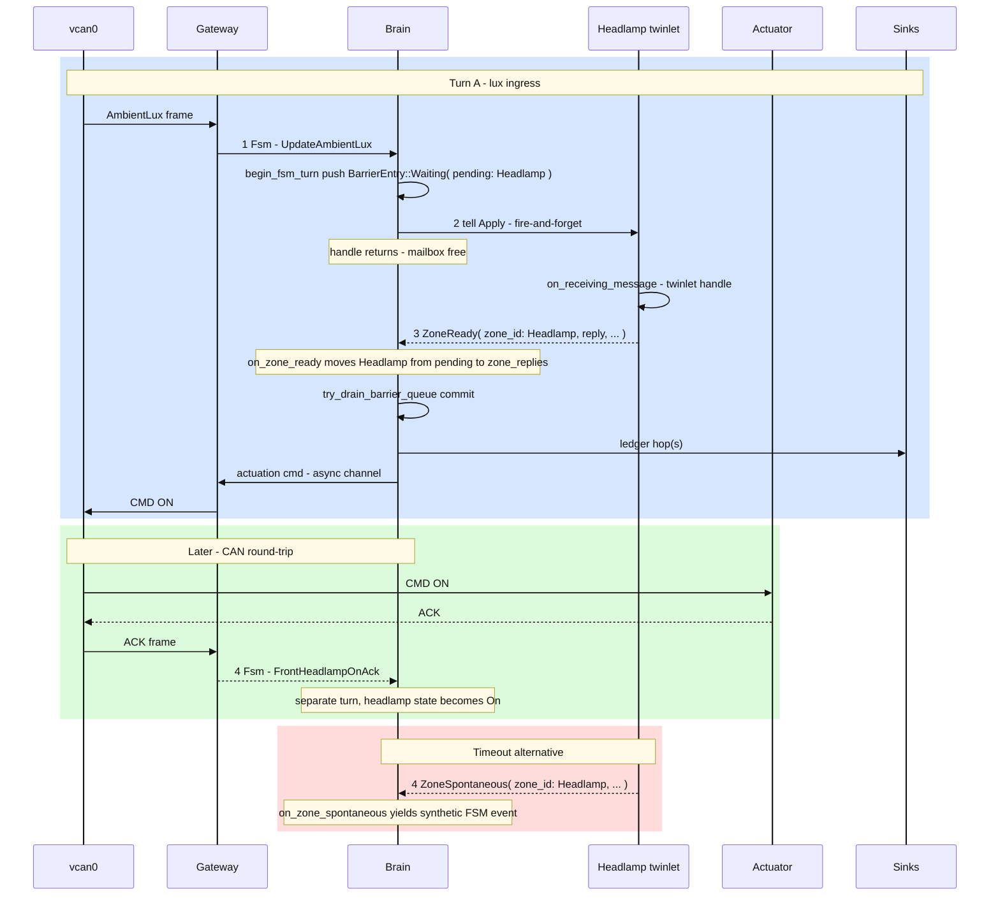
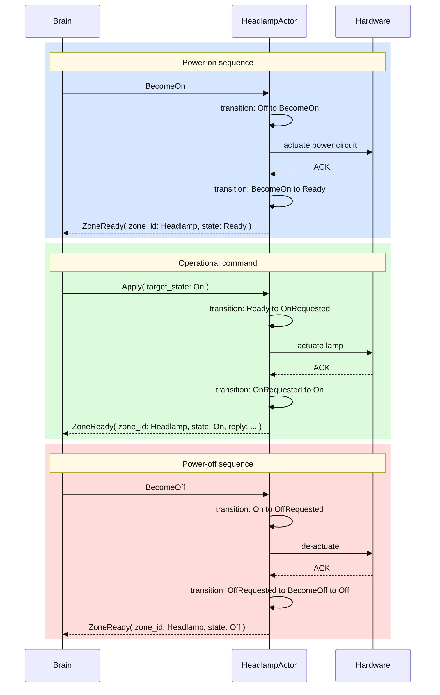

# SDV Simulation 4 — Brain FSM Redesign & Actorified Assembly Twinlets

---

↩️ This repo is **Iteration 4** of a software-defined-vehicle (#SDV) prototype. Each iteration
**grows on its predecessor** — reusing and refactoring what still fits, and changing structure
where the next goal requires it.

| Iteration | Repository | Focus |
|-----------|-----------|-------|
| 1 | [`sdv_simulation_1`](https://github.com/nsengupta/sdv_simulation_1) | First working CAN control loop |
| 2 | [`sdv_simulation_2`](https://github.com/nsengupta/sdv_simulation_2) | Assembly-based zone contexts, transition ledger, diagnostics |
| 3 | [`sdv_simulation_3`](https://github.com/nsengupta/sdv_simulation_3) | Headlamp twinlet (first actorified assembly), quiescent commit |
| **4** | **`sdv_simulation_4` (this repo)** | **Brain FSM Redesign** — start/stop barriers, generic assembly envelopes, ROB turn queue, second assembly (Wiper) |

---

## What This Iteration Is About

Iteration 4 completes the **Brain FSM Redesign**. The central goal was to replace the
Iteration-3 monolithic `handle()` — which had 5 match arms and a fragile
`Option<PendingBrainTurn>` — with a clean **`VecDeque<BarrierEntry>` drain loop**, a
**re-order buffer (ROB)** pattern that decouples assembly tell-back arrival order from event
ingress order.

### Why a TurnBarrier?

The Brain actor's mailbox receives both of:
1.  External events, coming from Controller, viz., `PowerOn`, `RainsStarted` etc.
2.  Conversational events, coming from the Assemblies, viz., `ZoneReady(Headlamp)`

In Iteration 3, each CAN ingress produced a *single* pending turn. If two events - say, 
HeadLampOn arrived while the first was still awaiting a headlamp tell-back, the second was stuffed into a
`VecDeque` backlog. When replies arrived out of order (e.g. event B's reply arrived before
event A's), the ledger recorded them in arrival order, violating causal consistency.

**`TurnBarrier`** solves this: every ingress event gets its own barrier pushed onto a
`VecDeque<BarrierEntry>`. Each barrier tracks which assemblies (`BTreeSet<AssemblyId>`) must
reply before it can commit. The drain loop inspects only the **front** entry: if its
`pending` set is non-empty, the loop stalls; once empty (or if the entry is `Passthrough`),
it pops and commits. This guarantees that the ledger records events in ingress order
regardless of reply arrival order.

### Why `PreparingToStart` / `PreparingToStop`?

Iteration 3 had no formal power-cycle protocol: `IgnitionOffReset` was handled speculatively
in the actor code. The new FSM introduces two explicit preparing states:

- **`PreparingToStart(BTreeSet<AssemblyId>)`** — entered on `PowerOn`. The Brain emits
  `StartAssemblies` domain actions (→ `BecomeOn` tells to each assembly) and counts down
  `AssemblyZoneReady` acknowledgements. When the set empties, the FSM transitions to `Idle`.
- **`PreparingToStop(BTreeSet<AssemblyId>)`** — entered on `PowerOff` from `Idle`. Symmetric
  shutdown: emit `StopAssemblies` (→ `BecomeOff` tells to each assembly), count down 
  acknowledgements, then transition to `Off`.

The `BTreeSet<AssemblyId>` embedded in the state variant is the **sole authoritative
countdown** — no duplicate state in `VehicleContext`.

### Improvements over Iteration 3

- **ROB ordering**: The `VecDeque<BarrierEntry>` drain loop guarantees causal consistency
  regardless of assembly reply arrival order. Event ingress order is the ledger order.
- **Generic assembly envelopes**: Mailbox variants `ZoneReady { zone_id, reply }` and
  `ZoneSpontaneous { zone_id, event }` replace headlamp-specific `HeadlampZoneReady` /
  `HeadlampZoneSpontaneous`. Adding a new assembly (Wiper) requires zero new `handle()` arms.
- **FSM-driven lifecycle**: `StartAssemblies` / `StopAssemblies` domain actions are emitted
  by `output()` on entry to preparing states, replacing the old manual `BecomeOn`/`BecomeOff`
  wiring in tests.
- **Per-assembly retry**: `ZoneTellBackTimeout { zone_id, turn_id, tell_attempt }` retries
  each unresponsive assembly independently, rather than a single `TellBackTimeout { turn_id }`
  that retried all zones at once.
- **Second assembly (Wiper)**: `AssemblyId::Wiper` is now defined alongside `Headlamp` in
  `ALL_ASSEMBLIES`. Wiper lifecycle is in-process (not a separate twinlet actor yet).
- **`PendingBrainTurn` deleted**: The old enum and its special-case handling are fully absorbed
  into the ROB pattern.
- **Brain Actor's `handle()` arms**: Exactly 4 arms — `Fsm`, `ZoneReady`,
  `ZoneTellBackTimeout`, `GetStatus`. Zero new arms per new assembly.

---

## Vocabulary

Terms used throughout this README.

| Term | Meaning                                                                                                                                                                                                        |
|------|----------------------------------------------------------------------------------------------------------------------------------------------------------------------------------------------------------------|
| **Assembly** | A managed device group identified by `AssemblyId` (`Headlamp`, `Wiper`). Each assembly has a lifecycle (`<BecomeOn>` → `Ready` → … → `<BecomeOff>` → `Off`) and a `{Assembly}Context` in `VehicleContext`.     |
| **Twinlet** | One assembly as a **child actor** under the BrainTwin (mailbox + timers).                                                                                                                                      |
| **Brain** | The digital twin overall — parent actor (`VirtualCarActor`), quiescent commit, ledger, actuation. State: `DigitalTwinCar`.                                                                                     |
| **Zone** | SDV industry term for a vehicle concern. The mailbox vocabulary uses `ZoneReady` / `ZoneReply` / `ZoneSpontaneousEvent` as generic envelopes — these are **not** the internal tracking type (`AssemblyId` is). |
| **Tell** | Brain → twinlet; **fire-and-forget** (mailbox free until tell-back or timeout).                                                                                                                                |
| **Tell-back** | Twinlet → Brain reply (`turn_id`, `tell_attempt`; e.g. `ZoneReady { zone_id: Headlamp, … }`).                                                                                                                  |
| **Spontaneous** | Twinlet tell-back on its **own deadline** (e.g. ACK timer), not a new CAN ingress.                                                                                                                             |
| **Cut** | Snapshot `(FsmState, VehicleContext)` at one instant.                                                                                                                                                          |
| **Quiescence** | Multi-hop resolve to a **stable cut**; one ledger row per hop; one `apply_step`.                                                                                                                               |
| **ROB** | Re-order buffer (`VecDeque<BarrierEntry>`) — preserves event ingress order regardless of assembly reply arrival order.                                                                                         |
| **TurnBarrier** | One per ingress event: tracks which assemblies have replied, holds per-assembly timers and replies.                                                                                                            |
| **Pyramid** | Layered modules in `common` (**L0**–**L6**, physics up to gateway/actuator binaries); acyclic imports.                                                                                                         |

---

## Brain FSM States

The Brain's operational FSM governs the Digital Twin's mode. All 7 states:

```
Off ──PowerOn──► PreparingToStart({Headlamp, Wiper})
                       │ each AssemblyZoneReady(id) removes id
                       ▼
                PreparingToStart({Wiper})
                       │ AssemblyZoneReady(Wiper) → set empty
                       ▼
                     Idle ──UpdateRpm > threshold──► Driving
                       │                                  │
                 PowerOff                           stationary
                       │                                  │
                       ▼                                  ▼
           PreparingToStop({Headlamp, Wiper})           Idle
                       │ symmetric to start
                       ▼
                      Off

  Driving ──Internal(LightingUnsafe)──► DrivingDangerously
  DrivingDangerously ──headlamp On or lux high or stationary──► Driving or Idle
  Driving ──speed > 160 km/h──► ExtremeOperationWarning(now) ──TimerTick + cooldown──► Driving
```

Full transition table: [`diagrams/fsm_state_transitions.md`](diagrams/fsm_state_transitions.md)

### Key invariants

- `transition()` is a **pure function** — no I/O, no actor, no heap allocation or discovery
  of runtime resources. It receives only `(old_state, event, ctx)` and returns
  `(new_state, maybe_error)`. All side effects (timers, tells, ledger writes) are driven by
  the caller from the returned state.
- `output()` is a **pure function** — maps `(old_state, new_state, ctx)` to `Vec<FsmAction>`.
- Both are called exactly once per event, in strict order, from the actor's `handle()` thread.
- Execution of `tansition()` and `output()` is always single-threaded.
- The `BTreeSet<AssemblyId>` inside `PreparingToStart` / `PreparingToStop` is the **sole
  authoritative countdown** while waiting for responses from all the assemblies that the brain has. 
  Each `AssemblyZoneReady(id)` event removes that `id` from the set. When the set becomes empty, the transition function maps to `Idle` (start) or `Off`
  (stop). No separate `remaining_assemblies` field exists in `VehicleContext`.
- External events that arrive **during** a preparing state are recorded in the ledger with
  `applied: false` and discarded — they are never replayed. Events that arrive **after** the
  FSM has reached `Idle` are processed according to their semantic meaning (e.g. `UpdateRpm`
  may transition to `Driving`).
- `PowerOff` is **rejected** (logged) in `Driving`, `DrivingDangerously`, `ExtremeOperationWarning`,
  or `Off`.
- Every power cycle goes through a preparing state — never `Off ↔ Idle` directly.

---

## Assembly FSM States

Each assembly transitions independently through its own lifecycle states, driven by
`BecomeOn` / `BecomeOff` tells from the Brain. The assembly acknowledges readiness via
`AssemblyZoneReady(AssemblyId)` tell-backs.

```
Off ──BecomeOn──► Ready ──lux≤threshold──► OnRequested ──AckOn──► On
▲                    ▲    ◄──ActIncompl(On)/Timeout──              │
│                    │                                             │ BecomeOff
│                    │                                             ▼
│                    │◄──────────── AckOff ────────────────── OffRequested
│                    │                                               │
│                    └──────── BecomeOff ────────────────────────────┘
└────────────────────────── BecomeOff ───────────────────────────────┘
```

**Events** (messages from Brain):
- **`BecomeOn`** — Brain tell: power up the assembly lifecycle.
- **`BecomeOff`** — Brain tell: power down the assembly lifecycle.

**States:**
- **Off** — Initial; no actuation. Ignores all zone messages except `BecomeOn`/`BecomeOff`.
- **Ready** — Idle but powered; awaiting lux threshold command.
- **OnRequested** — ON actuation sent to hardware; awaiting `AckOn`.
- **On** — Physical lamp confirmed ON by hardware ACK.
- **OffRequested** — OFF actuation sent to hardware; awaiting `AckOff`.

Full diagram: [`diagrams/headlamp_assembly_state_transition.md`](diagrams/headlamp_assembly_state_transition.md)

---

## Architecture (L0–L6 Pyramid)

The `common` crate follows an acyclic layer pyramid. The critical invariant:
**L2 (`fsm`) must not import L3 or above**.

```
L0  vehicle_physics          Constants, pure kinematics (no FSM, no I/O)
L1  vehicle_state            Assemblies: powertrain, health, visibility, headlamp
L2  fsm                      FsmState, FsmEvent, step(), transition_map — pure decision core
L3  digital_twin, published  Twin capsule (DigitalTwinCar), serializable ledger projection
L4  twin_runtime, sinks      VirtualCarActor, HeadlampActor, turn_barrier, detectors
L5  facade                   Public surface — the only module gateway binaries may import
L6  gateway, emulator,       Application binaries — never import internal modules
    front_headlamp_actuator
```

Detail: [`docs/library-reorg.md`](docs/library-reorg.md)

---

## Brain Architecture (VirtualCarActor)

```text
DigitalTwinCarVocabulary (mailbox)
├── Fsm(FsmEvent)                         ← CAN ingress / detector events
├── ZoneReady { zone_id, turn_id, reply } ← twinlet tell-back (correlated)
├── ZoneSpontaneous { zone_id, event }    ← twinlet tell-back (unsolicited)
├── ZoneTellBackTimeout { zone_id, … }    ← per-assembly retry deadline
└── GetStatus(RpcReplyPort<CarSnapshot>)  ← synchronous snapshot query

VirtualCarActor (Brain)
├── barrier_queue: VecDeque<BarrierEntry>  ← ROB (Waiting / Passthrough variants)
│   └── TurnBarrier                        ← per-assembly pending set + timers + replies
├── on_zone_ready()                       ← matches barrier by turn_id
├── on_zone_timeout()                     ← per-assembly retry or synthetic reply
├── on_zone_spontaneous()                 ← unsolicited twinlet event
├── begin_fsm_turn()                      ← pushes barrier, tells assembly(ies)
└── try_drain_barrier_queue()             ← commits completed barriers front-to-back
```

### Tell / tell-back flow



---

## Assembly Architecture (HeadlampActor)

Each assembly twinlet runs as a child actor under the Brain. The HeadlampActor is the only
fully actorified twinlet in this iteration; Wiper is in-process.

```text
HeadlampActorMsg (mailbox)
├── Apply(BrainTurn)                      ← Brain tell: apply new state
├── BecomeOn                              ← Brain tell: power up lifecycle
├── BecomeOff                             ← Brain tell: power down lifecycle
└── Internal(FrontHeadlampOnAck)          ← actuator ACK (spontaneous)

HeadlampActor
├── ctx: HeadlampContext                  ← domain state
├── state_machine: AssemblyStateMachine   ← assembly lifecycle FSM
├── ack_timer: Option<JoinHandle<...>>    ← ACK deadline timer
├── on_receiving_message()               ← match on Apply / BecomeOn / BecomeOff
└── send_to_brain()                       ← tell-back ZoneReady / ZoneSpontaneous
```

### Assembly lifecycle flow



---

## TurnBarrier — ROB Pattern

Each external ingress or twinlet spontaneous event creates one `TurnBarrier` wrapped in
`BarrierEntry` and pushed onto `barrier_queue`. The drain loop commits barriers **strictly in
ingress order**, regardless of which assembly replies arrive first.

```rust
pub(crate) struct TurnBarrier {
    turn_id:        u64,
    event:          FsmEvent,
    now:            Instant,

    pending:        BTreeSet<AssemblyId>,       // assemblies not yet replied
    zone_waits:     HashMap<AssemblyId, TellBackWait>,
    zone_timers:    HashMap<AssemblyId, TellBackTimer>,
    zone_replies:   HashMap<AssemblyId, ZoneReply>,
    zone_messages:  HashMap<AssemblyId, ZoneMessage>,
}

pub(crate) enum BarrierEntry {
    Waiting(TurnBarrier),                     // awaiting one or more assembly tell-backs
    Passthrough(PassthroughBarrier),          // no zone tell needed; committable immediately
}
```

**Drain invariant:** `while let Some(front) = barrier_queue.front()` — examine front entry;
if `Waiting` with non-empty `pending` set, stop; if `Passthrough` or `Waiting` with empty
`pending`, pop and commit. Only the front entry may be committed.

This solves the **ordering problem** from Iteration 3: when two assembly-directed events
arrive, then assembly replies arrive in reverse order (e.g. Wiper replies before Headlamp
replies to event A), the ledger still records event A before event B.

---

## Assembly Routing During Preparing States

The routing function `zone_message_for_event` returns `None` for all external events during
`PreparingToStart` / `PreparingToStop`. No tell is sent. The event is recorded in the ledger
with `applied: false` and discarded. Events that arrive after the FSM reaches `Idle` are
routed normally according to their semantic meaning.

---

## Quiescent Commit

One external ingress or twinlet message triggers **one quiescent commit**: the Brain runs
0+ **hops** (each → one ledger row), then `apply_step` once on the final stable cut, then
merged actuation.

```text
tell-back / ingress -> hop -> hop -> ... -> stable -> apply_step -> actuation
                        |-- one ledger row per hop --|
```

Detectors (e.g. `LightingUnsafe`) are pure functions in `twin_runtime/detectors/`. They
propose `FsmEvent::Internal(...)` events; the transition table decides. The loop terminates
when no detector fires or `MAX_QUIESCENCE_HOPS` is reached.

---

## How to Run

**Three processes** share Linux **SocketCAN** (`vcan0` by default):

```bash
# Terminal 1 — CAN emulator (RPM + lux)
cargo run -p emulator

# Terminal 2 — Headlamp actuator (body ECU stand-in)
cargo run -p front_headlamp_actuator

# Terminal 3 — Gateway (Brain + HeadlampActor)
cargo run -p gateway

# Optional: ledger-only output (no diagnostics)
cargo run -p gateway -- --print-transitions-only
```

### Prerequisites

- Linux with `vcan0` set up:
  `sudo modprobe vcan; sudo ip link add dev vcan0 type vcan; sudo ip link set up vcan0`
- Rust toolchain (MSRV: latest stable)

---

## Project Structure

```text
crates/
├── common/                     # L0–L5 library pyramid
│   └── src/
│       ├── vehicle_physics/    # L0: constants, kinematics
│       ├── vehicle_state/      # L1: assembly contexts (powertrain, health, visibility, headlamp)
│       ├── fsm/                # L2: FsmState, FsmEvent, step(), transition_map
│       │   ├── machineries.rs  #    State/event/action enums, AssemblyId, ALL_ASSEMBLIES
│       │   ├── transition_map.rs  # transition() + output()
│       │   └── step.rs         #    step() orchestrator
│       ├── digital_twin/       # L3: DigitalTwinCar, mailbox vocabulary
│       ├── published/          # L3': PublishedTransitionRecord
│       ├── twin_runtime/       # L4: actors, turn_barrier, detectors
│       │   ├── controller/     #    VirtualCarActor (Brain)
│       │   ├── headlamp_actor.rs  # HeadlampActor twinlet
│       │   ├── turn_barrier.rs    # TurnBarrier, BarrierEntry, TellBackWait
│       │   ├── zone_tell_back.rs  # TellBackWait, retry logic (legacy, migrating to turn_barrier)
│       │   ├── zone_turn.rs       # zone_message_for_event routing
│       │   ├── zone_replies.rs    # ZoneReplies helper
│       │   └── detectors/      #    LightingUnsafe, etc.
│       ├── facade.rs           # L5: public API surface
│       └── lib.rs              # module declarations
├── gateway/                    # L6: CAN I/O, Brain wiring
├── emulator/                   # L6: RPM + lux publisher
├── front_headlamp_actuator/    # L6: body ECU stand-in
└── vehicle_device_bus/         # CAN protocol constants
diagrams/
├── fsm_state_transitions.md          # Brain FSM state diagram
└── headlamp_assembly_state_transition.md  # Headlamp assembly lifecycle
docs/
├── library-reorg.md            # Pyramid layering detail
└── rpm-model-tutorial.md       # Emulator RPM model explanation
```

---

## Tests

```bash
# Run all tests
cargo test -p common

# Run specific contract suites
cargo test -p common -- test::quiescence_actor_contract
cargo test -p common -- test::zone_tell_back_contract
cargo test -p common -- test::turn_barrier_contract
cargo test -p common -- test::headlamp_ack_timer_contract
cargo test -p common -- test::headlamp_lifecycle_contract
```

### Key contract tests

| Suite | What it validates |
|-------|-------------------|
| `quiescence_actor_contract` | End-to-end Brain turns: ingress → tell → tell-back → commit → ledger |
| `zone_tell_back_contract` | Per-assembly retry, exhaustion, synthetic reply, concurrent assembly timeouts |
| `turn_barrier_contract` | ROB ordering: reverse-reply-order, backlog drainage, multi-barrier drain |
| `headlamp_ack_timer_contract` | ACK deadline, spontaneous incomplete, DrivingDangerously transition |
| `headlamp_lifecycle_contract` | `HeadlampContext::on_receiving_message` in isolation (no actor) |
| `scenarios_smoke` | Full scenario: PowerOn → Idle → Driving → PowerOff |

---

## Design Documents

| Document | Content |
|----------|---------|
| [`DESIGN.md`](DESIGN.md) | Consolidated architecture reference (full Iteration 4 design) |
| [`diagrams/fsm_state_transitions.md`](diagrams/fsm_state_transitions.md) | Brain FSM state transition diagram (Mermaid) |
| [`diagrams/headlamp_assembly_state_transition.md`](diagrams/headlamp_assembly_state_transition.md) | Headlamp assembly lifecycle diagram (Mermaid) |
| [`docs/library-reorg.md`](docs/library-reorg.md) | Library pyramid detail (L0–L6, TangleGuard) |
| [`docs/rpm-model-tutorial.md`](docs/rpm-model-tutorial.md) | Emulator RPM model (intuition-first) |

---

## What Iteration 4 Is *Not* (Yet)

- Not a full vehicle SDV stack — only `HeadlampActor` is a twinlet; Wiper is in-process.
- Not production safety certification — the correctness model is a teaching scaffold.
- Not the offline ledger analyser — the gateway can emit a machine-oriented transition stream;
  the reader/report tool is designed but unbuilt.
- Not a replacement for the pyramid/ADR docs — see `docs/library-reorg.md`.

Known gaps carried forward to Iteration 5: CAN emulation for `PowerOn`/`PowerOff`, non-blocking
actuation (child actor), HeadlampActor isolation tests, `ActuationIncomplete(Off)` coverage.
