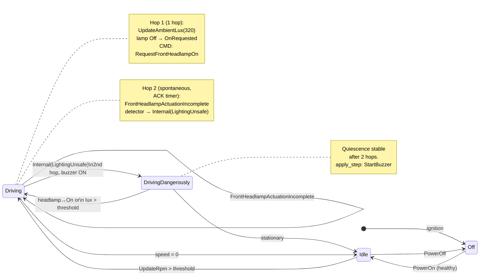

+++
title = "Prototyping a Software Defined Vehicle - Stage III"
date = 2026-06-07
draft = true

[taxonomies]
tags = ["sdv-prototype"]
+++

### Preface

The preceding [Stage II](@/blog/Prototype-Software-Defined-Vehicle-2/index.md) gave us per-zone assemblies but in-process, a portable transition ledger, and an FSM that coordinates rather than micromanages. The demo looked the same — three processes on `vcan0`, the same headlamp ACK/NACK loop — but the internals were ready to split.

**Stage III is the break-up.** The headlamp zone moves out of the BrainTwin's (the chief, coordinating actor in the DigitalTwin of the car) main mailbox into its own actor — a **twinlet** — communicating via fire-and-forget **tell** and asynchronous **tell-back**. The BrainTwin becomes a quiescence engine: it runs multiple internal hops per external event, consulting a **detector** library to promote unsafe world states into `FsmEvent::Internal` transitions, and publishing one ledger row per hop so the offline replay tool sees every intermediate decision.

Same `cargo run -p gateway -- --print-transitions-only` output? Almost — you'll now see one row per quiescence hop when detectors fire. Same CAN traffic? Yes. Same three processes? Yes. Everything that changed sits inside the gateway process.

---

### What actually changed (and what did not)

**Unchanged:** three processes on `vcan0`; the same wire IDs and FSM states; the rule that the twin emits **intent**, not raw I/O; the `FRONT_HEADLAMP_ACTUATOR_DROP_RESPONSE_PROB` env-var that injects ACK failures.

**Changed underneath:** 

- in-process zone turn → **enumerated mailbox** with `tell`/`tell-back`/`spontaneous` ; the Headlamp (child) Actor has its own logic (see below)

- single-hop `commit_brain_turn` → **`run_to_quiescence`** with 0+ hops; the FSM generates its own events to stay true to its independence

- the pyramid library layout (L0–L6) is now **TangleGuard-clean**; see below

- a **detector catalog** promotes operational alerts into the FSM table; 

- the gateway can run in **ledger-only mode** (coloured transitions on stdout, no diagnostic noise).

Details, crate paths, and the full architecture walkthrough is live in the [**Iteration 3 README**](https://github.com/nsengupta/sdv_simulation_3/blob/main/README.md).

---

### Design decision 1 — Actorify the first zone (HeadlampActor)

Stage II introduced zone _assemblies_ — `PowertrainContext`, `HeadlampContext`, `VisibilityContext`, and `VehicleHealthContext` — each owning its data and local rules. The natural next step: give **one** assembly its own actor, prove the pattern, then clone it for the next zone.

Why start with headlamp? It has the richest lifecycle — lighting requests, ACK/NACK timeouts, ignition-off resets — and therefore surfaces the most actor-protocol design decisions. Powertrain and health are simpler; they can stay in-process until the pattern is stable.

Here is the new actor boundary:

```rust
// Brain tells (fire-and-forget), twinlet tells back (also fire-and-forget).
// No one blocks on a reply port — the brain's mailbox stays free.

pub enum HeadlampActorMsg {
    Apply(HeadlampActorVocabulary),
    AckWaitElapsed { direction: FrontHeadlampSwitchDirection },
}

pub struct HeadlampActorVocabulary {
    pub message: HeadlampMessage,   // e.g. AmbientLux(320), AckOn
    pub now: Instant,
    pub turn_id: u64,
    pub tell_attempt: u32,
    pub brain: ActorRef<DigitalTwinCarVocabulary>,
}
```

The brain calls `tell_headlamp_zone()` — a single `send_message` with no reply port — then **returns** from its own `handle()`. The twinlet processes the message in its own mailbox, runs `HeadlampContext::on_receiving_message()`, and sends back either `HeadlampZoneReady` (reply to the ingress) or `HeadlampZoneSpontaneous` (ACK timer expiry). Meanwhile the brain is free to serve `GetStatus` queries or enqueue a backlog.

The flow for a single lux ingress now spans three mailbox deliveries:

```text
CAN → Gateway → Brain: Fsm(UpdateAmbientLux(320))
  Brain → HeadlampActor: tell Apply { message: AmbientLux(320), turn_id: 42 }
  Brain handle() returns (pending turn, mailbox free)
  HeadlampActor: on_receiving_message() → zone reply
  HeadlampActor → Brain: HeadlampZoneReady { turn_id: 42, reply }
  Brain: merge reply → commit_resolved_turn → run_to_quiescence → ledger → actuation
```

The old approach blocked the brain's `handle()` with a synchronous `call` / reply-port. That worked for one zone but would not scale to six or eight. The fire-and-forget pattern costs nothing extra for the headlamp zone today and buys a mailbox that stays responsive under multi-zone load tomorrow.

**Phase A embed.** During tell-back, the brain copies `HeadlampZoneReply.ctx` into `VehicleContext.headlamp` before `apply_step`. This is a deliberate bridge: the twinlet is the source of truth for headlamp state, and the embed copies it into the parent `VehicleContext` so existing `fsm::step` and ledger code works unchanged. Later phases (C) may shrink the embed to a handle — but the test suite (ledger assertions, `GetStatus` replies) surfaces gaps when the embed shrinks before the query path is ready.

---

### Design decision 2 — Quiescence and the ledger-as-audit-trail

Stage II had one `commit_brain_turn` per external event: one `step()` call, one ledger row, done. But what happens when an external event reveals an unsafe world state? For example: the headlamp ACK timer fires because the actuator never responded. The lamp is still off, the car is driving in the dark. The twin must enter `DrivingDangerously`, sound a buzzer, and tell the driver — all as a consequence of that one missing ACK.

Stage III introduces **quiescence**: the brain runs a hop loop until no detector proposes an internal event.

> **What's a hop?** One hop = one transition of the FSM: the brain takes a **cut** `(FsmState, VehicleContext)`, feeds a single `FsmEvent` into `transition()` + `step()`, and produces a new cut — one row in the ledger. A hop is the smallest atomic unit of state change. The loop runs 0+ hops until quiescence (stable cut), then calls `apply_step` once to actuate.

```text
tell-back / ingress → hop → hop → ... → stable → apply_step → actuation
                        └── one ledger row per hop ──┘
```

The entry point is `commit_resolved_turn`, which delegates to `run_to_quiescence`:

```rust
pub fn run_to_quiescence(
    initial_state: &FsmState,
    initial_ctx: &VehicleContext,
    ingress: &FsmEvent,
    now: Instant,
    zone_replies: &ZoneReplies,
) -> QuiescentResult {
    let mut queue = vec![ingress.clone()];
    let mut state = initial_state.clone();
    let mut ctx = initial_ctx.clone();
    let mut hops = Vec::new();

    while let Some(event) = queue.first().cloned() {
        if hops.len() >= MAX_QUIESCENCE_HOPS { break; }
        queue.remove(0);

        let is_first = hops.is_empty();
        let hop_replies = if is_first { zone_replies }
                         else { &ZoneReplies::default() };

        let result = apply_single_hop(&state, &ctx, &event, now, hop_replies);

        // Detectors inspect the exit cut and may enqueue an internal event
        if let Some(internal) = detect_internal_after_hop(
            &result.next_state, &result.modified_ctx
        ) {
            queue.push(internal);
        }

        state = result.next_state.clone();
        ctx = result.modified_ctx.clone();
        hops.push(HopRecord { event, result });
    }

    QuiescentResult { hops }
}
```

Here is a state‑transition diagram that visualises the two‑hop quiescence flow — and contrasts it with the one‑hop happy path — for the low‑visibility / headlamp‑actuation scenario:

```text
           ┌──────────────────────────────────────────────────┐
           │                  Drives into tunnel              │
           │          UpdateAmbientLux(320) arrives           │
           └──────────────────────┬───────────────────────────┘
                                  │
                                  ▼
                ┌─────────────────────────────────┐
                │  ┌─── step(Driving, e)  ────┐   │
                │  │  state: Driving          │   │
                │  │  lamp: Off→OnRequested   │   │
                │  │  CMD: RequestFront...On  │   │
                │  └──────────────────────────┘   │
                │          Hop 1 (1 hop)          │
                │      quiescence stable ✅       │
                └─────────────────────────────────┘
                                  │
                    ┌─────────────┴─────────────┐
                    │                           │
                    ▼                           ▼
         ┌─────────────────────┐    ┌──────────────────────────────┐
         │ ACK arrives ok      │    │ ACK timer fires (timeout)    │
         │ lamp→On             │    │                              │
         │ stay in Driving     │    │ Hop 2 event:                 │
         │ (happy path,        │    │ FrontHeadlampActuationInc.   │
         │  no more hops)      │    │ cut: Driving·lamp Off·low lux│
         └─────────────────────┘    │                              │
                                    │ detector reads exit cut →    │
                                    │ Internal(LightingUnsafe)     │
                                    │                              │
                                    ▼ Hop 3 event:                 │
                         ┌──────────────────────┐                  │
                         │ Internal(LightingU)  │                  │
                         │ state: DrivingDang.  │◄─────────────────┘
                         │ buzzer ON            │
                         │ quiescence stable ✅ │
                         └──────────────────────┘
```

And in Mermaid syntax (render with any Mermaid live editor for a cleaner view):



Each hop produces a unique `HopRecord`, which becomes a `PublishedTransitionRecord` in the ledger. The offline replay tool sees:

```
record_seq 13: UpdateAmbientLux(320)       → Driving,  headlamp=OffRequested
record_seq 14: Internal(LightingUnsafe)     → DrivingDangerously, headlamp=OffRequested
```

Both rows appear in the same quiescent commit, with sequential `record_seq` values. Consumer code that reads the ledger does not need special handling — internal events look like any other FSM event, just with a different discriminant.

**Detectors are library functions, not brain overrides.** The first detector — `lighting_unsafe_detector` — checks the exit cut for the unsafe pattern (driving, dark, lamp not confirmed ON). It returns `Some(FsmEvent::Internal(Operational::LightingUnsafe))` or `None`. The quiescence loop calls it after every hop; the `transition_map` table is the sole authority for what state `Driving + Internal(LightingUnsafe)` transitions into. No post-`step` patch. No shadow state machine.

```rust
// docs/adr-007-fsm-quiescence-and-cut.md — inviolable FSM rule:
// transition_map ONLY sets next_state; detectors only propose events.
```

This keeps the FSM table **the** mode story. Detectors live in their own module (`twin_runtime/detectors/`) with unit-testable predicates; `transition_map` remains a compact table of `(state, event) → next_state` entries.

---

### Design decision 3 — The pyramid library layout (L0–L6)

Stage I was a monolith. Stage II started the layering. Stage III **completes** it — the `common` crate now has an acyclic L0–L6 pyramid, verified by [TangleGuard](https://tangleguard.com/).

| Layer  | Module(s)                                        | Role                                                               |
| ------ | ------------------------------------------------ | ------------------------------------------------------------------ |
| **L0** | `vehicle_physics`                                | Constants and pure kinematics (traction, RPM/Speed)                |
| **L1** | `vehicle_state`, `domain_types`, `signals`       | Zone contexts, wire vocabulary, VSS signal IDs                     |
| **L2** | `fsm`                                            | Pure decision core — `step`, `transition_map` — imports L0/L1 only |
| **L3** | `digital_twin`, `published`                      | Twin capsule, invariants, serializable mirror types                |
| **L4** | `transition_sink`, `diagnostic`, `twin_runtime`  | Actor runtime (BrainTwin + twinlets), sinks, detectors             |
| **L5** | `facade`                                         | Public surface — the only module gateway binaries may import       |
| **L6** | `gateway`, `emulator`, `front_headlamp_actuator` | Application binaries                                               |

The critical rule: **L2 (`fsm`) must not import L3 or above.** The FSM is a pure function — no actor, no I/O, no runtime dependency. It takes `(State, Context, Event, Instant)` and returns `StepResult`. That makes it testable at the speed of a function call, not a mailbox round-trip.

The gateway imports **only `common::facade`** — a single doorway to the entire library pyramid. A CI script (`scripts/check-gateway-facade-imports.sh`) enforces this gate.

```rust
// facade.rs — the L5 public API
pub use crate::twin_runtime::controller::{
    ActuationCommand, CorrelationId, VehicleController, VehicleControllerError,
    VehicleControllerRuntimeOptions,
};
pub use crate::domain_types::{PhysicalCarVocabulary, VehicleEvent, VehicleState};
pub use crate::digital_twin::CarSnapshot;
pub use crate::vehicle_state::HeadlampState;
pub use crate::diagnostic::spawn_stdout_diagnostic_observer;
pub use crate::published::PublishedTransitionRecord;
// ... signal tokens, wire log constants, timing constants ...
```

The shape matters because the next logical step — splitting `common` into separate `sdv_core` and `sdv_runtime` crates — is a rename, not a rewrite.

---

### Design decision 4 — Two observation streams, one ledger mode

Stage II drew the line between **transition ledger** (lossless, ordered, replayable) and **diagnostic log** (best-effort, human-readable). Stage III keeps that line and adds a **ledger-only runtime mode**:

```bash
cargo run -p gateway -- --print-transitions-only
# Coloured transition rows on stdout; no diagnostic sink, no ingress banners
```

The gateway code selects the sink wiring at startup:

```rust
let diagnostic_tx = if launch.print_transitions_only {
    None                                         // no diagnostic sink
} else {
    let (diag_tx, diag_rx) = mpsc::unbounded_channel();
    let _diag_observer = spawn_stdout_diagnostic_observer(diag_rx);
    Some(diag_tx)
};

let transition_tx = if launch.print_transitions_only {
    let (tx, rx) = mpsc::channel::<PublishedTransitionRecord>(256);
    let color = std::io::stdout().is_terminal();
    let _ = transition_log::spawn_transition_log_task(rx, color);
    Some(tx)
} else {
    None
};
```

The diagnostic sink is **best-effort** (`try_send`, drop-on-being-full) — a frozen terminal (Ctrl-S / XOFF) can never stall the ACK delivery path. The transition sink uses a bounded `mpsc::channel` and signals full/closed errors rather than dropping silently; the ledger is the authoritative record.

The offline reader tool is designed but not yet built — the `PublishedTransitionRecord` wire format is ready, and the ledger-only mode validates that the gateway can produce a clean stream without diagnostic noise. Future work: a CLI tool that ingests the stream between two `record_seq` values and reports statistics.

---

### Design decision 5 — Spontaneous tell-back and the ACK timer

In Stage II, the gateway ran a `TimerTick` loop and the BrainTwin checked headlamp ACK deadlines in-band. In Stage III, the **twinlet owns its deadlines**.

When `HeadlampActor::handle_apply` processes a message that arms a headlamp ON/OFF request, it sets an actor timer (`send_after`):

```rust
fn maybe_arm_ack_timer(myself: &ActorRef<HeadlampActorMsg>, state: &mut HeadlampActorState) {
    let direction = match state.ctx.state {
        HeadlampState::OnRequested => FrontHeadlampSwitchDirection::SwitchOn,
        HeadlampState::OffRequested => FrontHeadlampSwitchDirection::SwitchOff,
        _ => return,
    };
    let wait = match direction {
        FrontHeadlampSwitchDirection::SwitchOn => FRONT_HEADLAMP_ON_ACK_WAIT,
        FrontHeadlampSwitchDirection::SwitchOff => FRONT_HEADLAMP_OFF_ACK_WAIT,
    };
    abort_ack_timer(&mut state.ack_timer);
    state.ack_timer = Some(myself.send_after(wait, move || {
        HeadlampActorMsg::AckWaitElapsed { direction }
    }));
}
```

When the timer fires, the twinlet sends a **spontaneous** tell-back — `DigitalTwinCarVocabulary::HeadlampZoneSpontaneous` — which the BrainTwin treats as a new ingress. The quiescence loop then runs the detector, which sees `Driving + lux < threshold + HeadlampState::Off` and emits `Internal(LightingUnsafe)`. A second hop lands in `DrivingDangerously` with a buzzer action.

The key insight: the ACK timer is not the brain's responsibility. The twinlet handles its own deadline, and the brain merely responds to the tell-back. This keeps the brain's message handling uniform — every ingress is either an external `FsmEvent` or a twinlet tell-back — and eliminates the `TimerTick`-scanning pattern that would multiply as more zones join.

---

### Code walkthrough — A complete lux-to-ledger path

Let's trace one low-lux CAN frame through the entire pipeline.

**1. CAN ingress.** The gateway CAN reader thread sees a `VssSignal::AmbientLux(320)` frame on `vcan0`. It decodes it to a `PhysicalCarVocabulary::AmbientLux(320)` and sends it through a `mpsc::unbounded_channel` to the async dispatch loop.

**2. Ingress dispatch.** The async loop calls `controller.send_event(...)`, which wraps the physical vocabulary in `DigitalTwinCarVocabulary::Fsm(FsmEvent::UpdateAmbientLux(320))` and sends it to the BrainTwin's mailbox.

**3. BrainTwin `handle`.** The `VirtualCarActor::handle` matches `Fsm(evt)`. It checks whether a turn is already pending (backlog if so). Otherwise it calls `begin_fsm_turn`.

**4. Zone demux.** `fsm_event_headlamp_message(&event)` returns `Some(HeadlampMessage::AmbientLux(320))` — this event needs the headlamp twinlet.

**5. Tell.** `begin_headlamp_wait` calls `tell_headlamp_zone(...)`, which does a single `send_message` on the twinlet's mailbox. No reply port. The brain arms a tell-back timeout timer and stashes `PendingBrainTurn::PrimaryHeadlamp`. The `handle` returns — the mailbox is free for `GetStatus` or backlog events.

**6. Twinlet process.** The `HeadlampActor::handle_apply` runs:

```rust
let zone_reply = state.ctx.on_receiving_message(message, now);
state.ctx = zone_reply.ctx.clone();
maybe_arm_ack_timer(myself, state);
brain.send_message(DigitalTwinCarVocabulary::HeadlampZoneReady {
    turn_id,
    tell_attempt,
    reply: zone_reply,
})?;
```

The twinlet updates its own `HeadlampContext` and tells back. Because the lux is low and the emulator crossing the deadband, the headlamp state transitions to `OnRequested`, and the ACK timer arms.

**7. Embed and quiescence.** The BrainTwin receives `HeadlampZoneReady`. It aborts the tell-back timer, copies the reply's `HeadlampContext` into `VehicleContext.headlamp`, and calls `commit_resolved_turn`:

```rust
let resolved = ResolvedTurn {
    ingress: FsmEvent::UpdateAmbientLux(320),
    now,
    zone_replies: ZoneReplies::with_headlamp_ingress(reply),
};
let result = commit_resolved_turn(&current_state, &current_ctx, resolved);
```

This runs `run_to_quiescence`. Hop 1 processes `UpdateAmbientLux(320)` through `step` → `transition_map` stays in `Driving` → headlamp is now `OnRequested`. The detector checks the exit cut: `Driving` + `OnRequested` is not yet unsafe (the ACK may still arrive). No internal event — one hop, done.

**8. Actuation.** The brain reads the merged `DomainAction::RequestFrontHeadlampOn` from the `QuiescentResult`, sends it to the actuation channel, and the gateway's command publisher encodes and writes a CAN CMD frame.

**9. Later — ACK or timeout.** The actuator responds (or not). The ACK/NACK frame arrives on CAN as a new ingress, enters the brain as `FsmEvent::FrontHeadlampOnAck` or `FrontHeadlampOffAck` (or the `ActuationIncomplete` from the spontaneous timer), and another quiescent commit processes it. The ledger now has two rows: the lux event and the ACK event. The offline reader can reconstruct the full sequence.

---

### Code walkaround — Behavioural verification

Stage II introduced `verify_state_laws` — an offline oracle that checks named invariants against a captured snapshot. Stage III adds **runtime detectors** and keeps the same oracle on `CarSnapshot` (available via `GetStatus` for consumer-side checking).

The first detector — `lighting_unsafe_detector` — is a pure function:

```rust
pub fn lighting_unsafe_detector(
    exit_state: &FsmState,
    exit_ctx: &VehicleContext,
) -> Option<FsmEvent> {
    // Driving in the dark without a confirmed lamp: dangerous.
    if *exit_state == FsmState::Driving
        && exit_ctx.visibility.ambient_lux < LUX_ON_THRESHOLD
        && (exit_ctx.headlamp.state == HeadlampState::Off
            || exit_ctx.headlamp.state == HeadlampState::OffRequested)
    {
        return Some(FsmEvent::Internal(Operational::LightingUnsafe));
    }
    None
}
```

It lives in `twin_runtime/detectors/lighting_unsafe.rs`, is unit-tested independently of the actor, and is registered in the catalog entry point `detect_internal_after_hop`. When the real actuator drops a response (simulated via `FRONT_HEADLAMP_ACTUATOR_DROP_RESPONSE_PROB`), the ACK timer fires, the spontaneous tell-back arrives, and the detector promotes the **next** hop to `DrivingDangerously`.

This is the same principle as Stage II's **enforce / announce / detect** — but now detection runs inside the quiescence loop, not as a separate offline pass. The three roles remain distinct:

1. **Enforce** — illegal operational cuts are rejected or clamped in the FSM `transition_map` itself.
2. **Announce** — would-be or clamped violations reach the **diagnostic** sink as warnings.
3. **Detect** — `verify_state_laws` / `STATE_LAWS` catalog for offline replay and CI; **runtime detectors** in the quiescence loop for fast, hot-path guards.

The offline `verify_state_laws` remains the authoritative oracle for the full recorded ledger; the detectors are fast, runtime guards that operate on the current hop exit cut.

---

### What comes next

**1. A second twinlet.** The headlamp twinlet is a template. The next zone — powertrain or health — can follow the same pattern: define `{Zone}Context::on_receiving_message`, spawn a child actor, tell fire-and-forget, merge tell-back into `VehicleContext`, run quiescence. The pattern is documented in `docs/milestone-actor-headlamp-scope.md`.

**2. ADR-6 power barrier.** During `PowerOff` coordination, stray ingress must appear in the ledger with `applied: false` rather than being silently dropped. The current `fsm_backlog` (a `VecDeque` on the brain) is an interim design; the target is a ledger row per suppressed event plus a power barrier in the CAN ingress path.

**3. Ledger reader / reporter tool.** The `PublishedTransitionRecord` format is shaped for an offline tool that ingests rows between two `record_seq` values and reports transitions, dwell times, and state-law violations. The tool is designed but unbuilt; the ledger-only gateway mode (`--print-transitions-only`) validates the stream quality.

**4. Actuation child actor.** Today, actuation egress (CAN CMD write) is an `ActuationManager` trait wired through the gateway runtime, not an actor. Moving it into a child actor with its own tell-back completes the actorification pattern.

**5. Pyramid crate split.** The `common` crate is L0–L6; splitting `sdv_core` (L0–L3) from `sdv_runtime` (L4–L5) reduces recompilation and enforces the layer boundaries at the crate level.

---

### Summary

Stage III makes the digital twin **actor-based without rewriting the domain core**. The same `fsm::step` function, the same zone assemblies, and the same `VehicleContext` aggregate power the demo — but the headlamp zone now runs in its own actor, the brain runs quiescence over multiple internal hops per external event, and the pyramid library layout is acyclic and TangleGuard-verified.

From the user's perspective: same demo, same three processes, same CAN commands. From the developer's perspective: the groundwork for multi-zone actorification is laid, the ledger captures every decision (external and internal), and the detector library provides a principled path for operational policy without compromising the FSM table's authority.

---

**Where the code is**

- Repository: [**`sdv_simulation_3`**](https://github.com/nsengupta/sdv_simulation_3) on GitHub — builds on [**`sdv_simulation_2`**](https://github.com/nsengupta/sdv_simulation_2).
- Operational reference: [project **README**](https://github.com/nsengupta/sdv_simulation_3/blob/main/README.md) (crate layout, architecture sequence diagram, flags, demo assets).
- This post is the **narrative**; the README on **`main`** is the **current truth** for running and extending the prototype.

---

**Series:** Prototyping a Software Defined Vehicle

**← Previous** [Stage II](@/blog/Prototype-Software-Defined-Vehicle-2/index.md)

All posts in this series: [sdv-prototype](/tags/sdv-prototype/)
