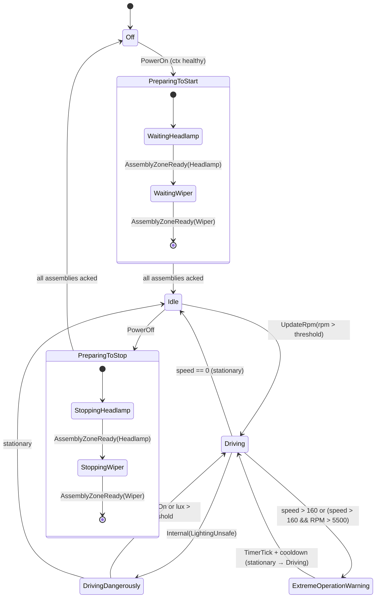

# Brain FSM — State Transition Diagram

## States

| State | Meaning |
|---|---|
| `Off` | Ignition off; no assemblies active. |
| `PreparingToStart({remaining assemblies})` | PowerOn received; waiting for each assembly to acknowledge `BecomeOn`. Countdown via `AssemblyZoneReady(id)`. |
| `Idle` | All assemblies started; ignition on, vehicle stationary (rpm ≤ threshold). |
| `Driving` | RPM > `RPM_DRIVING_THRESHOLD`; normal driving. |
| `DrivingDangerously` | Driving in dark without confirmed lighting (step 7 operational policy). |
| `ExtremeOperationWarning(began_at)` | Speed > 160 km/h or (speed > 160 and RPM > 5500). Buzzer active; recovers via `TimerTick` after cooldown. |
| `PreparingToStop({remaining assemblies})` | PowerOff received from `Idle`; waiting for each assembly to acknowledge `BecomeOff`. Countdown symmetric to start. |

## Transition Diagram



## Complete Transition Table

| From | Event | To | Notes |
|---|---|---|---|
| `Off` | `PowerOn` (healthy ctx) | `PreparingToStart({Headlamp, Wiper})` | Emits `StartAssemblies` |
| `Off` | `PowerOn` (unhealthy) | `Off` | Self-loop; rejected |
| `Off` | `PowerOff` | `Off` | Rejected (logged) |
| `Off` | anything else | `Off` | Self-loop |
| `PreparingToStart({a,…})` | `AssemblyZoneReady(a)` | `PreparingToStart({…})` | Removes `a` from set |
| `PreparingToStart(∅)` | last ack (implicit) | `Idle` | Set empty → transition |
| `PreparingToStart(_)` | anything else | `PreparingToStart(_)` | Self-loop (set unchanged) |
| `Idle` | `UpdateRpm(rpm > threshold)` | `Driving` | |
| `Idle` | `PowerOff` | `PreparingToStop({Headlamp, Wiper})` | Emits `StopAssemblies` |
| `Idle` | anything else | `Idle` | Self-loop |
| `Driving` | `Internal(LightingUnsafe)` | `DrivingDangerously` | |
| `Driving` | speed > 160 or extreme | `ExtremeOperationWarning(now)` | |
| `Driving` | stationary (speed == 0) | `Idle` | |
| `Driving` | `PowerOff` | `Driving` | Rejected (logged) |
| `Driving` | anything else | `Driving` | Self-loop |
| `DrivingDangerously` | stationary | `Idle` | |
| `DrivingDangerously` | headlamp `On` or lux > threshold | `Driving` | |
| `DrivingDangerously` | `PowerOff` | `DrivingDangerously` | Rejected (logged) |
| `DrivingDangerously` | anything else | `DrivingDangerously` | Self-loop |
| `ExtremeOperationWarning(began)` | `TimerTick` + cooldown + no warning | `Driving` (or `Idle` if stationary) | |
| `ExtremeOperationWarning(began)` | `PowerOff` | `ExtremeOperationWarning(began)` | Rejected (logged) |
| `ExtremeOperationWarning(began)` | anything else | `ExtremeOperationWarning(began)` | Self-loop |
| `PreparingToStop({a,…})` | `AssemblyZoneReady(a)` | `PreparingToStop({…})` | Removes `a` from set |
| `PreparingToStop(∅)` | last ack (implicit) | `Off` | Set empty → transition |
| `PreparingToStop(_)` | anything else | `PreparingToStop(_)` | Self-loop (set unchanged) |

## Internal Events (synthesized by detectors)

| Event | Source | When |
|---|---|---|
| `Internal(LightingUnsafe)` | `LightingUnsafe` detector | `Driving` + dark lux + headlamp `Off` or `Ready` |
| `TimerTick` | Actor timer | Periodic tick for `ExtremeOperationWarning` cooldown check |

## Assembly Lifecycle

Each assembly (Headlamp, Wiper) transitions independently and acknowledges via `AssemblyZoneReady(id)`:

```
Off ──BecomeOn──► Ready ──► On/Off (actuation) ──BecomeOff──► Off
```

The Brain FSM counts down `PreparingToStart` / `PreparingToStop` sets as each assembly acknowledges. No assembly interaction is possible while the Brain is in a preparing state — external events are recorded in the ledger with `applied: false` and discarded.

## Key Invariants

1. `transition()` is a pure function: `(state, event, ctx, now) → (next_state, note)`.
2. `output()` is a pure function: `(old_state, new_state, ctx) → Vec<FsmAction>`.
3. Both are called exactly once per event, strictly in order, from the actor's `handle()` thread.
4. The countdown set inside `PreparingToStart` / `PreparingToStop` is the sole authoritative countdown — `VehicleContext` carries no `remaining_assemblies`.
5. `PowerOff` is **rejected** (logged) when in `Driving`, `DrivingDangerously`, `ExtremeOperationWarning`, or `Off`.
6. `PowerOff` from `Idle` goes through `PreparingToStop` — never directly to `Off`.
