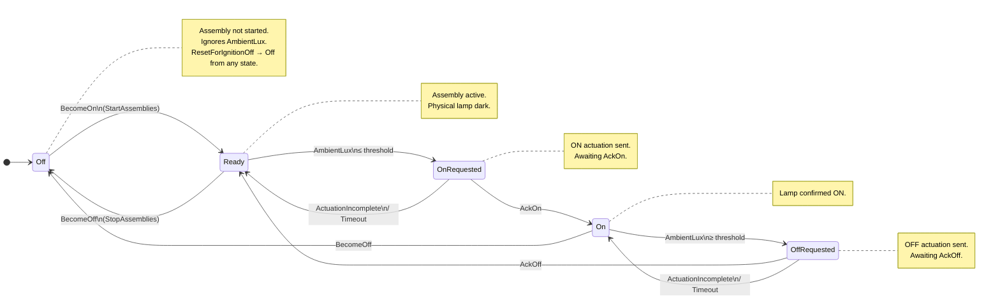

# Headlamp Assembly — State Transition Diagram

The headlamp zone uses five states with an actuation-ack protocol: ON and OFF
commands pass through `OnRequested` / `OffRequested` while waiting for hardware
`AckOn` / `AckOff`. Timeouts yield `ActuationIncomplete` outcomes and roll back.

## States

| State | Meaning |
|---|---|
| `Off` | Assembly not started. Ignores all zone messages except `BecomeOn` / `BecomeOff`. |
| `Ready` | Assembly active; physical lamp is dark. Waits for lux threshold to cross. |
| `OnRequested` | ON actuation command sent to hardware; waiting for `AckOn`. |
| `On` | Physical lamp confirmed ON by hardware ACK. |
| `OffRequested` | OFF actuation command sent to hardware; waiting for `AckOff`. |

## Transition Diagram

### Transition table (complete)

| From | Message / Event | To | Zone Outcome |
|---|---|---|---|
| `Off` | `BecomeOn` | `Ready` | — |
| `Off` | `BecomeOff` | `Off` | — (no-op; already off) |
| `Off` | `AmbientLux(_)` | `Off` | — (ignored; assembly not started) |
| `Off` | `ResetForIgnitionOff` | `Off` | — |
| `Ready` | `BecomeOff` | `Off` | — |
| `Ready` | `AmbientLux(lux ≤ LUX_ON_THRESHOLD)` | `OnRequested` | `RequestOn` |
| `Ready` | `AmbientLux(lux > LUX_ON_THRESHOLD)` | `Ready` | — (deadband) |
| `OnRequested` | `AckOn` | `On` | — |
| `OnRequested` | `ActuationIncomplete(On, _)` | `Ready` | `LogWarning` |
| `OnRequested` | `TimerTick` (at ON deadline) | `Ready` | `LogWarning` (via `ActuationIncomplete`) |
| `On` | `AmbientLux(lux ≥ LUX_OFF_THRESHOLD)` | `OffRequested` | `RequestOff` |
| `On` | `AmbientLux(lux < LUX_OFF_THRESHOLD)` | `On` | — (deadband) |
| `On` | `BecomeOff` | `Off` | — (forced shutdown) |
| `OffRequested` | `AckOff` | `Ready` | — (lamp off; assembly still active) |
| `OffRequested` | `ActuationIncomplete(Off, _)` | `On` | `LogWarning` (rollback) |
| `OffRequested` | `TimerTick` (at OFF deadline) | `On` | `LogWarning` (via `ActuationIncomplete`) |
| Any | `ResetForIgnitionOff` | `Off` | — |

### Notes

- `BecomeOn` and `BecomeOff` are the **lifecycle control messages** sent by the Brain when
  `StartAssemblies` / `StopAssemblies` actions fire (Phase 5 wires this end-to-end).
- In tests (Phase 2–4), `initial_headlamp_ctx` in `VehicleControllerRuntimeOptions` starts
  the headlamp in `Ready` directly, bypassing the not-yet-wired `BecomeOn` path.
- `ZoneId::Headlamp` is the opaque token used by the Brain to correlate zone replies with
  the originating assembly without coupling to headlamp-specific types.
- `LightingUnsafe` detector fires when `FsmState::Driving` + dark lux + headlamp is **`Off` or `Ready`**
  (both states mean the physical lamp is unlit; `Ready` adds the "assembly active but lux not yet processed" case).
