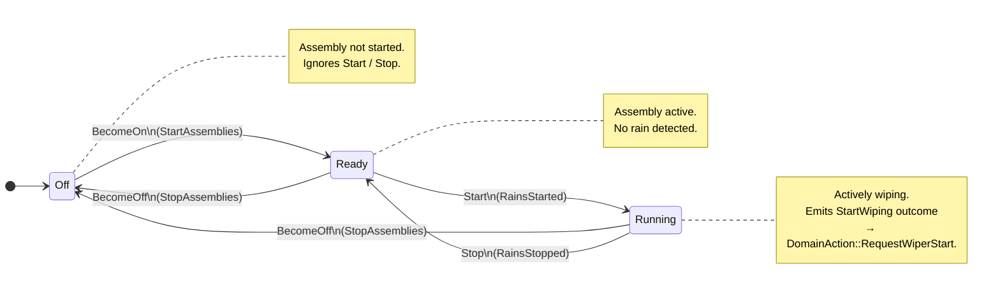

# Wiper Assembly — State Transition Diagram

The wiper zone has three states and no actuation-ack protocol. All transitions are
immediate: the twinlet replies `ZoneReady` in the same handling cycle, with no pending
intermediate state.



## Contrast with Headlamp

| Property | Headlamp | Wiper |
|---|---|---|
| States | Off, Ready, OnRequested, On, OffRequested | Off, Ready, Running |
| ACK protocol | Yes (`OnRequested` / `OffRequested` wait for hardware ACK) | No — transitions are immediate |
| ACK timer | Yes (`HeadlampActor` owns `send_after` deadline) | No |
| Spontaneous events | Yes (`ZoneSpontaneous` on ACK timeout) | No |
| Outcomes | `RequestOn`, `RequestOff`, `LogWarning` | `StartWiping`, `StopWiping`, `LogWarning` |

`LogWarning` is emitted only by the **synthetic unresponsive reply** when the twinlet
tell-back times out after the full retry budget, never by a normal operational transition.

## Tell-back flow (no ACK round-trip)

```
Brain                     WiperActor
  │── BecomeOn tell   ──────────►│
  │                              │ Off → Ready (immediate)
  │◄─── ZoneReady(Ready)   ──────│
  │
  │── Start tell  ──────────────►│
  │                              │ Ready → Running (immediate)
  │◄─── ZoneReady(Running)  ─────│
  │     outcomes: [StartWiping]
  │     → DomainAction::RequestWiperStart
  │     → ActuationCommand::StartWiper → CAN CMD
```
