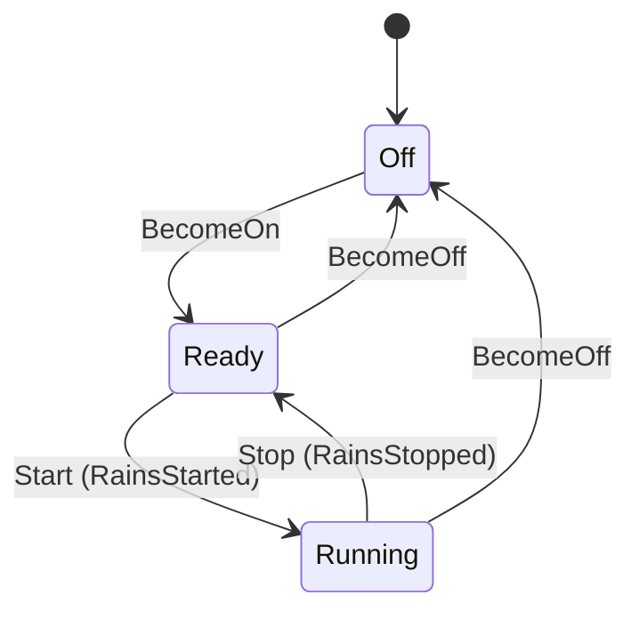

# Wiper Assembly — Design Plan

This document captures two things:

1. **Gap assessment** — what changes are needed to make Wiper a first-class assembly, on par with Headlamp.
2. **Lifecycle mechanics** — how Wiper already participates in the Brain's `PreparingToStart` / `PreparingToStop` states.

---

## Part 1 — Gap Assessment: Wiper as a First-Class Assembly

### Context

The internal actor plumbing for Wiper is already complete. `WiperActor`, `WiperContext`,
the ROB/TurnBarrier wiring, `AssemblyId::Wiper` in `ALL_ASSEMBLIES`, and the `zone_turn.rs`
routing for `RainsStarted` / `RainsStopped` all exist and are tested. What is missing is
the **vertical CAN slice** — the same physical I/O path Headlamp has — plus three small
in-tree stubs.

The changes fall into two tiers, plus documentation.

---

### Tier 1 — In-tree stubs (small, no new files)

The outcome/actuation path today drops Wiper silently.

| # | File | What to add |
|---|------|-------------|
| 1 | `crates/common/src/fsm/machineries.rs` | Add `DomainAction::RequestWiperStart` and `RequestWiperStop` to the `DomainAction` enum alongside the existing headlamp variants |
| 2 | `crates/common/src/twin_runtime/controller/actuation_contract.rs` | Add `ActuationCommand::StartWiper` and `StopWiper` (no `CorrelationId` needed — no ACK round-trip by design) |
| 3 | `crates/common/src/twin_runtime/outcome_map.rs` | Replace the `ZoneOutcome::Wiper(_) => None` stub with `StartWiping → RequestWiperStart`, `StopWiping → RequestWiperStop` |
| 4 | `crates/common/src/twin_runtime/controller/actuation_manager.rs` | Add match arms for `DomainAction::RequestWiperStart/Stop` → send `ActuationCommand::StartWiper/StopWiper` on the actuation channel |

These are one-liners to a few lines each. They close the outcome→actuation gap entirely
within the existing `common` crate.

---

### Tier 2 — The physical CAN slice (parallel to Headlamp's L6 path)

Headlamp has a full three-crate physical path; Wiper has none.

#### 2a. Rain sensor ingress (emulator → gateway → twin)

Headlamp analogue: lux sensor `VssSignal::AmbientLux` published by emulator, decoded by
gateway, projected to `FsmEvent::UpdateAmbientLux`.

| # | File | What to add |
|---|------|-------------|
| 5 | `crates/common/src/signals.rs` | Add `VssSignal::RainDetected(bool)` with a new CAN ID (e.g. `0x104`); extend `from_can_frame` and `to_can_frame` |
| 6 | `crates/common/src/twin_runtime/connectors/physical_to_digital.rs` | In the existing `TelemetryUpdate(vss)` match arm, map `VssSignal::RainDetected(true) → FsmEvent::RainsStarted`, `false → FsmEvent::RainsStopped` |
| 7 | `crates/emulator/src/…` | Publish periodic `VssSignal::RainDetected` frames on `vcan0` (rain-on / rain-off cycle alongside the existing RPM+lux loop) |

#### 2b. Wiper CAN device codec (parallel to `vehicle_device_bus/src/devices/front_headlamp/`)

Three new files under `crates/vehicle_device_bus/src/devices/wiper/`:

| # | File | What it contains |
|---|------|-----------------|
| 8 | `crates/vehicle_device_bus/src/devices/wiper/codec.rs` | `WiperCommandPayload { start: bool }` — encode START/STOP bytes |
| 9 | `crates/vehicle_device_bus/src/devices/wiper/can.rs` | `encode_command_frame(cmd: &ActuationCommand) → CanFrame` — analogous to headlamp's `can.rs` |
| 10 | `crates/vehicle_device_bus/src/devices/wiper/mod.rs` | Re-exports for `can` and `codec` |

No `policy.rs` is needed. Headlamp's policy tracks session/sequence numbers to correlate
ACK/NACK frames. Wiper has no ACK protocol, so there is no session state to manage.

Also: `crates/vehicle_device_bus/src/devices/mod.rs` needs a `pub mod wiper;` declaration.

#### 2c. Gateway command publisher (parallel to `spawn_front_headlamp_command_publisher`)

| # | File | What to add |
|---|------|-------------|
| 11 | `crates/gateway/src/gateway_runtime.rs` | `spawn_wiper_command_publisher` — opens CAN socket, listens on `actuation_cmd_rx` for `StartWiper`/`StopWiper`, calls wiper `encode_command_frame`, writes to `vcan0` |

The existing CAN reader thread already routes `VssSignal` frames to the twin, so rain
sensor ingress requires no new reader code once steps 5–6 are done.

#### 2d. Wiper actuator binary (new L6 crate, parallel to `crates/front_headlamp_actuator/`)

| # | Path | What it does |
|---|------|-------------|
| 12 | `crates/wiper_actuator/Cargo.toml` | New crate, depends on `vehicle_device_bus` + `socketcan` |
| 13 | `crates/wiper_actuator/src/main.rs` | Opens `vcan0`, reads CMD frames via wiper codec, simulates motor on/off (no ACK frame sent back — Wiper's simpler model) |
| 14 | Root `Cargo.toml` | Add `"crates/wiper_actuator"` to `[workspace] members` |

---

### Tier 3 — Documentation and tests

| # | File | What to add |
|---|------|-------------|
| 15 | `diagrams/wiper_assembly_state_transition.md` | Mermaid lifecycle diagram (`Off → Ready → Running`) parallel to `headlamp_assembly_state_transition.md` |
| 16 | `README.md` | Three stale passages say "Wiper is in-process / not a twinlet" — contradicted by the existing `WiperActor` code. Update project structure, `## How to Run`, test suite table, and `## What Iteration 4 Is Not` section |
| 17 | `crates/common/src/test/wiper_zone_contract.rs` | Expand existing 10 tests with: actor isolation test (parallel to headlamp's), and a `RainsStarted → Running → RainsStopped → Ready` full-lifecycle scenario |
| 18 | `crates/gateway/tests/assembly_interaction_e2e.rs` | Extend the existing wiper `Ready`-at-boot assertion with a `RainsStarted` → wiper `Running` turn |

---

### What does NOT need to change

The following headlamp capabilities are deliberate design choices for Headlamp only and
must **not** be cloned for Wiper:

- `AckWaitElapsed` mailbox variant — no ACK timer by design
- `ZoneSpontaneous` for Wiper — no spontaneous events by design
- `HeadlampIncompleteCause` / `FrontHeadlampSwitchDirection` — headlamp-specific FSM events
- `ActuationFeedback` variants for Wiper — no feedback loop by design
- `FrontHeadlampPolicy` (session/sequence dedup) — not needed without ACK

---

### Total scope

| Category | New files | Modified files |
|----------|-----------|---------------|
| Tier 1 (internal stubs) | 0 | 4 |
| Tier 2 (CAN slice) | 4 (`wiper/` codec + actuator crate) | 5 (`signals`, projector, emulator, gateway, `vdb/devices/mod`) |
| Tier 3 (docs + tests) | 1 (diagram) | 3 (README, wiper contract, e2e) |
| **Total** | **5** | **12** |

Roughly 17 touch points. None touches the Brain FSM, the ROB, the TurnBarrier, or the
L1 Wiper state machine itself. The mechanical pattern for every step is demonstrated by
Headlamp; Wiper simply omits the ACK/session layer.

---

## Part 2 — Wiper in `PreparingToStart` / `PreparingToStop`

### The core idea

Both preparing states hold a `BTreeSet<AssemblyId>` — seeded from `ALL_ASSEMBLIES` — and
the Brain FSM counts down that set **one assembly at a time** as each twinlet responds.
Wiper is just another entry in that set.

---

### `PreparingToStart` — step by step

#### Step 1 — `PowerOn` arrives, FSM enters the preparing state

`PowerOn` has no zone mapping in `zone_message_for_event`, so it becomes a
`PassthroughBarrier` that drains instantly. Inside `commit_resolved_turn`, the FSM
`step()` fires the transition:

```
Off + PowerOn (healthy ctx) → PreparingToStart({Headlamp, Wiper})
```

`ALL_ASSEMBLIES` is `&[Headlamp, Wiper]` (`machineries.rs`). The `output()` function
immediately emits:

```
(Off, PreparingToStart(_)) => vec![StartAssemblies(ALL_ASSEMBLIES.to_vec())]
```

#### Step 2 — Actor fans out two independent `BecomeOn` barriers

The `DomainAction::StartAssemblies(assemblies)` arm in `apply_committed_quiescence` loops
over the assembly list. For **each** assembly it:

1. Allocates a fresh `turn_id`
2. Constructs the assembly-specific `BecomeOn` tell via `become_on_message_for`
3. Fire-and-forgets the tell to the twinlet
4. Arms a `TellBackWait` + timer
5. Pushes a **separate** `TurnBarrier::new_for_assembly_zone` onto `barrier_queue`

The two barriers land on `barrier_queue` in insertion order: Headlamp first (lower
`turn_id`), Wiper second. Each barrier carries
`FsmEvent::AssemblyZoneReady(assembly_id)` as its embedded event — that is what will be
committed to the FSM when the barrier drains.

```rust
// new_for_assembly_zone wires the event at construction time
let mut barrier = TurnBarrier::new(turn_id, FsmEvent::AssemblyZoneReady(assembly_id), now);
barrier.add_pending_zone(assembly_id, message, wait, timer);
```

#### Step 3 — Each twinlet processes `BecomeOn` and replies

- `HeadlampActor`: `Off → Ready`, sends `ZoneReady { zone_id: Headlamp, turn_id: N, … }`
- `WiperActor`: `Off → Ready`, sends `ZoneReady { zone_id: Wiper, turn_id: N+1, … }`

These arrive in whatever order the scheduler delivers them.

#### Step 4 — ROB drain commits each reply in turn-id order

`on_zone_ready` finds the matching barrier by `turn_id` and marks the assembly's slot
complete. The drain loop only pops from the **front**.

If **Wiper replies first**: its barrier (`turn_id = N+1`) becomes complete, but it cannot
drain because the Headlamp barrier (`turn_id = N`) is still pending at the front. The drain
loop stalls.

When **Headlamp replies**: its barrier at the front drains, committing
`FsmEvent::AssemblyZoneReady(Headlamp)` to the FSM:

```
PreparingToStart({Headlamp, Wiper}) + AssemblyZoneReady(Headlamp) → PreparingToStart({Wiper})
```

The intra-preparing transition emits no actions (`output()` returns `vec![]`). The drain
loop then immediately pops the now-unblocked Wiper barrier:

```
PreparingToStart({Wiper}) + AssemblyZoneReady(Wiper) → Idle ✓
```

The `BTreeSet` embedded in the FSM state is the only countdown — no separate field in
`VehicleContext`.

#### Step 5 — Set empties, Brain reaches `Idle`

The `Off → PreparingToStart → … → Idle` path involves exactly two intra-preparing
self-loop steps (which emit nothing) before the final transition to `Idle` emits
`PublishStateSync`. The whole sequence adds zero new `handle()` arms to the Brain actor.

---

### `PreparingToStop` — exactly symmetric

`PowerOff` in `Idle` fans out `BecomeOff` barriers for Headlamp and Wiper via
`DomainAction::StopAssemblies`. Each twinlet transitions to `Off` and replies. The same
ROB drain commits two `AssemblyZoneReady` events one at a time, counting down:

```
PreparingToStop({Headlamp, Wiper}) → PreparingToStop({Wiper}) → Off
```

---

### What happens to external events during a preparing state

`zone_message_for_event` unconditionally returns `None` while in either preparing state:

```rust
match state {
    FsmState::PreparingToStart(_) | FsmState::PreparingToStop(_) => None,
    _ => user_event_to_zone_tell(event),
}
```

A `RainsStarted` that arrives while `WiperActor` is still starting up becomes a
`PassthroughBarrier` that drains immediately, hits the FSM as a self-loop on
`PreparingToStart`, is recorded in the ledger with `applied: false`, and is discarded. It
is never queued for replay after `Idle` is reached.

---

### Sequence diagram

```
PowerOn
  │── PassthroughBarrier → step() → PreparingToStart({Headlamp, Wiper})
  │                                 output() → StartAssemblies([Headlamp, Wiper])
  │
  ├─ tell BecomeOn → HeadlampActor    barrier_queue: [ HL:N pending ] [ WP:N+1 pending ]
  └─ tell BecomeOn → WiperActor

  WiperActor replies first:
    ZoneReady(Wiper, N+1) → barrier N+1 complete
                                       barrier_queue: [ HL:N ✗ ] [ WP:N+1 ✓ ]
                                       front is incomplete → drain stalls

  HeadlampActor replies:
    ZoneReady(Headlamp, N) → barrier N complete
                                       barrier_queue: [ HL:N ✓ ] [ WP:N+1 ✓ ]
    drain front (N)  → commit AssemblyZoneReady(Headlamp)
                     → PreparingToStart({Headlamp,Wiper}) → PreparingToStart({Wiper})
    drain next (N+1) → commit AssemblyZoneReady(Wiper)
                     → PreparingToStart({Wiper}) → Idle ✓
```

---

### Why adding a third assembly costs nothing

The design is intentionally assembly-count-agnostic. Adding a third assembly to
`ALL_ASSEMBLIES` extends the same `BTreeSet` countdown without touching the drain loop,
the transition table, or the barrier machinery. The Brain's `handle()` stays at exactly
four arms. The assembly list is the sole source of truth.

---

## Part 3 — Wiper Startup Failure: Ledger and Diagnostics

### Scenario

`BecomeOn` is sent to `WiperActor` during `PreparingToStart` but the actor never replies
within the tell-back deadline.

---

### Phase 1 — Retry budget exhausted (500 ms × 3 attempts)

The Brain arms a `TellBackTimer` alongside every `BecomeOn` tell. When Wiper stays silent
the timer fires `ZoneTellBackTimeout { zone_id: Wiper, turn_id: N+1, tell_attempt: 0 }`.
`on_zone_timeout` delegates to `TurnBarrier::act_on_zone_timeout`, which checks the retry
budget (`ZONE_TELL_BACK_MAX_RETRIES = 2`):

```
attempt 0 → timeout → Retry (next_attempt: 1) → re-tell + new timer
attempt 1 → timeout → Retry (next_attempt: 2) → re-tell + new timer
attempt 2 → timeout → GaveUp
```

Total wall-clock wait in production: 3 × 500 ms = **1 500 ms**.  In test: 3 × 50 ms.

---

### Phase 2 — Synthetic reply injected (GaveUp path)

On `GaveUp`, the actor calls `synthetic_reply_for(ctx, AssemblyId::Wiper)`:

```rust
AssemblyId::Wiper => ZoneReply::Wiper(WiperZoneReply {
    ctx: ctx.wiper.clone(),   // still Off — Wiper never transitioned
    outcomes: vec![],         // no outcomes today
}),
```

The synthetic reply carries the **current** `WiperContext` (state still `Off`) and no
outcomes. It is injected into the barrier via `act_on_zone_reply`, which empties `pending`
and marks the barrier complete.

---

### Phase 3 — Drain commits; FSM reaches `Idle` anyway

The drain loop pops the Wiper barrier and commits `FsmEvent::AssemblyZoneReady(Wiper)`
with the synthetic reply. The FSM transition fires:

```
PreparingToStart({Wiper}) + AssemblyZoneReady(Wiper) → Idle
```

The Brain reaches `Idle` regardless of whether Wiper actually started. The countdown
mechanism has no "failed assembly" concept — the `BTreeSet` is emptied the same way
whether the reply was real or synthetic.

---

### What the ledger records (the observable signal)

The `RawTransitionRecord` for the `AssemblyZoneReady(Wiper)` hop captures:

```
event:       AssemblyZoneReady(Wiper)
old_state:   PreparingToStart({Wiper})
next_state:  Idle
old_ctx:     wiper.state = Off    ← entered the hop as Off
current_ctx: wiper.state = Off    ← left the hop still Off
actions:     []
```

A successful startup would show `current_ctx.wiper.state = Ready`. The
discrepancy — `Idle` state with `wiper.state = Off` in the same ledger row — is the only
machine-readable evidence that startup silently failed.

---

### What the diagnostics show — the current gap

Headlamp's synthetic reply is constructed in `zone_tell_back.rs` with an explicit
`LogWarning` outcome:

```rust
HeadlampZoneReply {
    ctx: headlamp_ctx.clone(),
    outcomes: vec![HeadlampOutcome::LogWarning(format!(
        "headlamp tell-back unresponsive after {ZONE_TELL_BACK_ATTEMPT_COUNT} tell attempts"
    ))],
}
```

That outcome flows: `outcome_map` → `DomainAction::LogWarning` → `diag_warning` →
diagnostic sink as a `⚠️ Warning` message.

Wiper's synthetic reply has `outcomes: vec![]`. And `outcome_map` currently drops all
Wiper outcomes anyway (`ZoneOutcome::Wiper(_) => None`). **No diagnostic warning is
emitted when Wiper fails to start.** The Brain silently proceeds to `Idle` with a broken
Wiper context.

---

### The downstream consequence

Once in `Idle` with `wiper.state = Off`, a subsequent `RainsStarted` event routes
`WiperMessage::Start` to `WiperActor`. The L1 handler silently ignores `Start` when the
state is `Off`:

```rust
WiperMessage::Start => match self.state {
    WiperState::Ready   => { self.state = WiperState::Running; vec![WiperOutcome::StartWiping] }
    WiperState::Running | WiperState::Off => vec![],
},
```

The wiper never runs, no outcome is emitted, no diagnostic is produced. The failure
propagates silently into normal operation.

---

### What needs to be added

Two independent gaps must be closed for Wiper to match Headlamp's failure-visibility.

**Gap 1 — Warning on startup timeout (diagnostic parity)**

Add a `LogWarning(String)` variant to `WiperOutcome` and use it in the synthetic reply:

```rust
// crates/common/src/vehicle_state/wiper.rs
pub enum WiperOutcome {
    StartWiping,
    StopWiping,
    LogWarning(String),   // ← add
}

// crates/common/src/twin_runtime/controller/virtual_car_actor.rs
AssemblyId::Wiper => ZoneReply::Wiper(WiperZoneReply {
    ctx: ctx.wiper.clone(),
    outcomes: vec![WiperOutcome::LogWarning(format!(
        "wiper tell-back unresponsive after {ZONE_TELL_BACK_ATTEMPT_COUNT} tell attempts"
    ))],
}),
```

`outcome_map` must then map `WiperOutcome::LogWarning` → `DomainAction::LogWarning`,
mirroring the headlamp arm. The warning then flows through `diag_warning` into the
diagnostic sink.

**Gap 2 — Detector for state mismatch (deferred)**

The ledger row already records `wiper.state = Off` after `AssemblyZoneReady(Wiper)`,
making the anomaly machine-readable. However, the `detectors/` layer has no
`WiperStartFailed` internal event analogous to `LightingUnsafe` for headlamp. A future
detector could inspect `current_state == Idle && ctx.wiper.state == Off` and synthesise
an `Internal(WiperStartFailed)` event — but that requires a new `Operational` variant and
a transition rule, which is deferred to a later iteration.

For this iteration, **Gap 1 is the minimum needed** to surface the failure on the
diagnostic stream and make it operationally visible.

---

### Summary

| What happens | Status |
|---|---|
| `BecomeOn` retried 3× at 500 ms intervals | Works correctly today |
| Synthetic reply injected after retry exhaustion | Works — but Wiper synthetic has no `LogWarning` outcome |
| FSM reaches `Idle` regardless | Works — ROB drains, countdown empties |
| Ledger records `wiper.state = Off` at transition to `Idle` | Works — discrepancy is machine-readable |
| Diagnostic warning emitted to sink | **Missing** — `WiperOutcome::LogWarning` does not exist |
| Subsequent `RainsStarted` silently ignored | By-design consequence of `Start` in `Off` being a no-op |
| Detector for `wiper.state == Off` in `Idle` | Not implemented — deferred beyond this iteration |

---

## Part 4 — Implementation Steps (RED → GREEN)

Each step is a complete TDD cycle: write the failing test first, then implement the
minimum code to make it pass. Steps are ordered inside-out (L1 → L4 → L6) so that each
GREEN leaves the codebase in a compilable, fully-passing state before the next RED is
written.

The convention used in the test file column:
- **existing** — add the test to the named file that already exists
- **new** — create the named file (add `mod` declaration in `test/mod.rs`)

---

### Step 1 — `WiperOutcome::LogWarning` variant (L1)

**Files changed:** `crates/common/src/vehicle_state/wiper.rs`

**RED test** (`existing: wiper_zone_contract`)

```rust
#[test]
fn test_wiper_outcome_log_warning_variant_exists() {
    let outcome = WiperOutcome::LogWarning("test warning".to_string());
    assert!(matches!(outcome, WiperOutcome::LogWarning(_)));
}
```

Fails to compile: `WiperOutcome::LogWarning` does not exist.

**GREEN** — Add the variant:

```rust
pub enum WiperOutcome {
    StartWiping,
    StopWiping,
    LogWarning(String),
}
```

**Verify:** `cargo test -p common -- test::wiper_zone_contract` — all 11 tests green.

---

### Step 2 — `DomainAction::RequestWiperStart / RequestWiperStop` (L2)

**Files changed:** `crates/common/src/fsm/machineries.rs`

**RED test** (`new: wiper_actuation_contract`)

```rust
#[test]
fn test_wiper_domain_actions_are_distinct_and_exist() {
    assert_ne!(
        DomainAction::RequestWiperStart,
        DomainAction::RequestWiperStop
    );
}
```

Fails to compile: variants do not exist.

**GREEN** — Add to `DomainAction`:

```rust
RequestWiperStart,
RequestWiperStop,
```

**Verify:** `cargo test -p common` — all existing tests still green.

---

### Step 3 — `outcome_map` fills in the Wiper stub (L4)

**Files changed:** `crates/common/src/twin_runtime/outcome_map.rs`

**RED tests** (`existing: wiper_actuation_contract`)

```rust
#[test]
fn test_start_wiping_maps_to_request_wiper_start() {
    let outcomes = vec![ZoneOutcome::Wiper(WiperOutcome::StartWiping)];
    let actions = zone_outcomes_to_domain_actions(outcomes);
    assert_eq!(actions, vec![DomainAction::RequestWiperStart]);
}

#[test]
fn test_stop_wiping_maps_to_request_wiper_stop() {
    let outcomes = vec![ZoneOutcome::Wiper(WiperOutcome::StopWiping)];
    let actions = zone_outcomes_to_domain_actions(outcomes);
    assert_eq!(actions, vec![DomainAction::RequestWiperStop]);
}

#[test]
fn test_log_warning_wiper_maps_to_domain_log_warning() {
    let msg = "wiper unresponsive".to_string();
    let outcomes = vec![ZoneOutcome::Wiper(WiperOutcome::LogWarning(msg.clone()))];
    let actions = zone_outcomes_to_domain_actions(outcomes);
    assert_eq!(actions, vec![DomainAction::LogWarning(msg)]);
}
```

All three compile but fail: `outcome_map` returns `None` for all `ZoneOutcome::Wiper(_)`.

**GREEN** — Replace the stub:

```rust
ZoneOutcome::Wiper(wo) => match wo {
    WiperOutcome::StartWiping        => Some(DomainAction::RequestWiperStart),
    WiperOutcome::StopWiping         => Some(DomainAction::RequestWiperStop),
    WiperOutcome::LogWarning(msg)    => Some(DomainAction::LogWarning(msg)),
},
```

**Verify:** `cargo test -p common -- test::wiper_actuation_contract`

---

### Step 4 — `ActuationCommand::StartWiper / StopWiper` (L4 contract)

**Files changed:** `crates/common/src/twin_runtime/controller/actuation_contract.rs`,
`crates/common/src/test/mod.rs` (exhaustive match helpers)

**RED test** (`existing: wiper_actuation_contract`)

```rust
#[test]
fn test_wiper_actuation_commands_exist_and_are_distinct() {
    assert_ne!(
        format!("{:?}", ActuationCommand::StartWiper),
        format!("{:?}", ActuationCommand::StopWiper)
    );
}
```

Fails to compile.

**GREEN** — Add to `ActuationCommand`:

```rust
StartWiper,
StopWiper,
```

Because `inject_matching_ack` and `inject_matching_nack` in `test/mod.rs` exhaustively
match `ActuationCommand`, they will fail to compile. Add wildcard or explicit arms for
the new variants (they have no physical ACK path, so the helpers can panic or skip):

```rust
ActuationCommand::StartWiper | ActuationCommand::StopWiper => {
    panic!("wiper commands have no ACK path; use wiper-specific helpers")
}
```

**Verify:** `cargo test -p common` — all tests green.

---

### Step 5 — `actuation_manager` executes wiper actions (L4)

**Files changed:**
`crates/common/src/twin_runtime/controller/actuation_manager.rs`

**RED test** (`new: wiper_actuation_contract` — actor-level)

```rust
#[tokio::test]
async fn test_rains_started_emits_start_wiper_actuation_command() {
    let (controller, mut actuation_rx, _guard) =
        install_with_actuation("WIPER-ACT-1", 8).await;
    power_on_to_idle(&controller).await;

    controller
        .submit_fsm_event(FsmEvent::RainsStarted)
        .await
        .expect("rains started");

    let cmd = expect_actuation_command(
        &mut actuation_rx,
        Duration::from_secs(1),
    )
    .await;
    assert!(matches!(cmd, ActuationCommand::StartWiper), "got {cmd:?}");
}

#[tokio::test]
async fn test_rains_stopped_emits_stop_wiper_actuation_command() {
    let (controller, mut actuation_rx, _guard) =
        install_with_actuation("WIPER-ACT-2", 8).await;
    power_on_to_idle(&controller).await;
    // Start first so wiper is Running
    controller.submit_fsm_event(FsmEvent::RainsStarted).await.expect("start");
    let _ = expect_actuation_command(&mut actuation_rx, Duration::from_secs(1)).await;

    controller
        .submit_fsm_event(FsmEvent::RainsStopped)
        .await
        .expect("rains stopped");
    let cmd = expect_actuation_command(&mut actuation_rx, Duration::from_secs(1)).await;
    assert!(matches!(cmd, ActuationCommand::StopWiper), "got {cmd:?}");
}
```

Tests compile but the first assertion fails: no command arrives because
`actuation_manager` has no arm for `RequestWiperStart/Stop`.

**GREEN** — Add to `DefaultActuationManager::execute`:

```rust
DomainAction::RequestWiperStart => {
    if let Some(tx) = &self.actuation_command_tx {
        let _ = tx.send(ActuationCommand::StartWiper).await;
    }
}
DomainAction::RequestWiperStop => {
    if let Some(tx) = &self.actuation_command_tx {
        let _ = tx.send(ActuationCommand::StopWiper).await;
    }
}
```

Note: wiper has no ACK protocol so no `CorrelationId` is generated.

**Verify:** `cargo test -p common -- test::wiper_actuation_contract`

---

### Step 6 — Synthetic reply carries `LogWarning`; timeout surfaces on diagnostic stream (L4)

**Files changed:** `crates/common/src/twin_runtime/controller/virtual_car_actor.rs`

**RED test** (`new: wiper_startup_failure_contract`)

```rust
#[tokio::test]
async fn test_wiper_startup_timeout_ledger_shows_wiper_state_off_at_idle() {
    // Silent wiper; headlamp non-silent.
    let (tx, mut rx) = tokio::sync::mpsc::channel(32);
    let opts = VehicleControllerRuntimeOptions {
        transition_tx: Some(tx),
        test_silent_wiper: true,
        ..Default::default()
    };
    let (controller, handle) =
        VehicleController::install_and_start_with_options("WIPER-FAIL-1".into(), opts)
            .await.expect("spawn");
    let _guard = ActorGuard { addr: controller.get_actor_ref().clone(), handle };

    controller.send_power_on().await.expect("power on");

    // Headlamp auto-replies; wiper never does — wait for full retry budget.
    // ZONE_TELL_BACK_WAIT = 50ms in test, 3 attempts = 150ms.
    tokio::time::sleep(Duration::from_millis(500)).await;

    // Brain must have reached Idle (synthetic reply unblocked the wiper barrier).
    let snapshot = controller
        .get_snapshot(Some(ractor::concurrency::Duration::from_millis(100)))
        .await.expect("snapshot");
    assert_eq!(*snapshot.current_state(), FsmState::Idle);

    // Wiper context must still be Off (synthetic reply preserved current state).
    assert_eq!(
        snapshot.context().wiper.state,
        WiperState::Off,
        "wiper must still be Off after startup timeout"
    );

    // The AssemblyZoneReady(Wiper) ledger row must show wiper.state = Off.
    // Drain all rows and find the Wiper startup row.
    let mut wiper_row = None;
    while let Ok(Some(row)) =
        tokio::time::timeout(Duration::from_millis(50), rx.recv()).await
    {
        if matches!(row.event, PublishedFsmEvent::AssemblyZoneReady(a)
            if a == crate::published::PublishedAssemblyId::Wiper)
        {
            wiper_row = Some(row);
        }
    }
    let row = wiper_row.expect("AssemblyZoneReady(Wiper) row must exist in ledger");
    assert!(
        row.actions.iter().any(|a| matches!(a, PublishedDomainAction::LogWarning(_))),
        "ledger row must carry a LogWarning action for the unresponsive wiper"
    );
}
```

The test compiles but the final assertion fails: no `LogWarning` is in the ledger row
because the synthetic reply has `outcomes: vec![]`.

**GREEN** — Update `synthetic_reply_for` for Wiper:

```rust
AssemblyId::Wiper => ZoneReply::Wiper(WiperZoneReply {
    ctx: ctx.wiper.clone(),
    outcomes: vec![WiperOutcome::LogWarning(format!(
        "wiper tell-back unresponsive after {ZONE_TELL_BACK_ATTEMPT_COUNT} tell attempts"
    ))],
}),
```

After this change `outcome_map` (Step 3) routes `LogWarning` → `DomainAction::LogWarning`
→ `diag_warning` onto the diagnostic sink, and `step.rs` records it in the ledger row.

**Verify:** `cargo test -p common -- test::wiper_startup_failure_contract`

---

### Step 7 — `VssSignal::RainDetected` CAN signal (L0)

**Files changed:** `crates/common/src/signals.rs`

**RED test** (`new: wiper_signal_contract` in `common/src/test/`)

```rust
#[test]
fn test_rain_detected_true_encodes_and_decodes_roundtrip() {
    let signal = VssSignal::RainDetected(true);
    let frame = signal.to_can_frame().expect("encode true");
    assert_eq!(VssSignal::from_can_frame(&frame), Some(VssSignal::RainDetected(true)));
}

#[test]
fn test_rain_detected_false_encodes_and_decodes_roundtrip() {
    let signal = VssSignal::RainDetected(false);
    let frame = signal.to_can_frame().expect("encode false");
    assert_eq!(VssSignal::from_can_frame(&frame), Some(VssSignal::RainDetected(false)));
}

#[test]
fn test_rain_detected_can_id_does_not_collide_with_existing_signals() {
    // IDs 0x101 (speed), 0x102 (rpm), 0x103 (lux) are taken.
    // RainDetected must use a distinct ID.
    let rain_frame = VssSignal::RainDetected(true).to_can_frame().expect("encode");
    let lux_frame  = VssSignal::AmbientLux(50).to_can_frame().expect("encode lux");
    assert_ne!(rain_frame.id(), lux_frame.id(), "CAN ID collision");
}
```

All three fail to compile: `VssSignal::RainDetected` does not exist.

**GREEN** — Add to `signals.rs`:

```rust
pub const ID_RAIN_DETECTED: u16 = 0x104;

// in VssSignal enum:
RainDetected(bool),

// in from_can_frame:
ID_RAIN_DETECTED => {
    Some(Self::RainDetected(data[0] != 0))
}

// in to_can_frame:
Self::RainDetected(val) => {
    build_frame(ID_RAIN_DETECTED, &[*val as u8, 0])
}
```

**Verify:** `cargo test -p common -- test::wiper_signal_contract`

---

### Step 8 — `PhysicalToDigitalProjector` maps rain signal (L4 connector)

**Files changed:**
`crates/common/src/twin_runtime/connectors/physical_to_digital.rs`

**RED test** (`existing: projection_contract`)

```rust
#[test]
fn test_rain_detected_true_projects_to_rains_started() {
    let p = PhysicalToDigitalProjector;
    let vocab = PhysicalCarVocabulary::TelemetryUpdate(VssSignal::RainDetected(true));
    let result = p.project(vocab).expect("project");
    assert!(
        matches!(result, DigitalTwinCarVocabulary::Fsm(FsmEvent::RainsStarted)),
        "got {result:?}"
    );
}

#[test]
fn test_rain_detected_false_projects_to_rains_stopped() {
    let p = PhysicalToDigitalProjector;
    let vocab = PhysicalCarVocabulary::TelemetryUpdate(VssSignal::RainDetected(false));
    let result = p.project(vocab).expect("project");
    assert!(
        matches!(result, DigitalTwinCarVocabulary::Fsm(FsmEvent::RainsStopped)),
        "got {result:?}"
    );
}
```

Both compile but fail: `VssSignal::RainDetected` falls through the match, hitting
`VehicleSpeed`'s `InvalidPayload` error arm (or a non-exhaustive compile error).

**GREEN** — Add arm to `PhysicalToDigitalProjector::project`:

```rust
VssSignal::RainDetected(true)  => FsmEvent::RainsStarted,
VssSignal::RainDetected(false) => FsmEvent::RainsStopped,
```

**Verify:** `cargo test -p common -- test::projection_contract`

---

### Step 9 — End-to-end: physical rain ingress → `WiperState::Running` + `StartWiper` command (L4 integration)

**Files changed:** none — this is a pure verification test.

**RED test** (`existing: wiper_actuation_contract`)

```rust
#[tokio::test]
async fn test_physical_rain_ingress_transitions_wiper_to_running_and_emits_command() {
    let (controller, mut actuation_rx, _guard) =
        install_with_actuation("WIPER-E2E-1", 8).await;
    power_on_to_idle(&controller).await;
    wait_wiper_state(&controller, WiperState::Ready, Duration::from_millis(500)).await;

    controller
        .submit_physical_car_event(PhysicalCarVocabulary::TelemetryUpdate(
            VssSignal::RainDetected(true),
        ))
        .await
        .expect("rain ingress");

    wait_wiper_state(&controller, WiperState::Running, Duration::from_millis(500)).await;

    let cmd = expect_actuation_command(&mut actuation_rx, Duration::from_secs(1)).await;
    assert!(matches!(cmd, ActuationCommand::StartWiper), "got {cmd:?}");
}

#[tokio::test]
async fn test_physical_rain_stop_ingress_transitions_wiper_to_ready_and_emits_command() {
    let (controller, mut actuation_rx, _guard) =
        install_with_actuation("WIPER-E2E-2", 8).await;
    power_on_to_idle(&controller).await;
    wait_wiper_state(&controller, WiperState::Ready, Duration::from_millis(500)).await;

    controller
        .submit_physical_car_event(PhysicalCarVocabulary::TelemetryUpdate(
            VssSignal::RainDetected(true),
        ))
        .await.expect("start rain");
    let _ = expect_actuation_command(&mut actuation_rx, Duration::from_secs(1)).await;

    controller
        .submit_physical_car_event(PhysicalCarVocabulary::TelemetryUpdate(
            VssSignal::RainDetected(false),
        ))
        .await.expect("stop rain");

    wait_wiper_state(&controller, WiperState::Ready, Duration::from_millis(500)).await;
    let cmd = expect_actuation_command(&mut actuation_rx, Duration::from_secs(1)).await;
    assert!(matches!(cmd, ActuationCommand::StopWiper), "got {cmd:?}");
}
```

These compile after Steps 1–8 but fail because Steps 7+8 are not yet implemented.
After Step 8 is green, rerun — both pass.

**Verify:** `cargo test -p common -- test::wiper_actuation_contract`

---

### Step 10 — Wiper CAN device codec (L6, `vehicle_device_bus`)

**Files changed (new):**
`crates/vehicle_device_bus/src/devices/wiper/mod.rs`,
`crates/vehicle_device_bus/src/devices/wiper/codec.rs`,
`crates/vehicle_device_bus/src/devices/wiper/can.rs`,
`crates/vehicle_device_bus/src/devices/mod.rs` (add `pub mod wiper`)

**RED test** (`new: crates/vehicle_device_bus/tests/wiper_can_codec.rs`)

```rust
#[test]
fn test_encode_start_wiper_produces_correct_can_frame() {
    use vehicle_device_bus::devices::wiper::can::encode_command_frame;
    use common::twin_runtime::controller::actuation_contract::ActuationCommand;

    let frame = encode_command_frame(&ActuationCommand::StartWiper)
        .expect("encode start");
    // data byte 0x01 = start; assert CAN ID matches WIPER_CMD_ID constant
    assert_eq!(frame.data()[0], 0x01);
}

#[test]
fn test_encode_stop_wiper_produces_correct_can_frame() {
    use vehicle_device_bus::devices::wiper::can::encode_command_frame;
    use common::twin_runtime::controller::actuation_contract::ActuationCommand;

    let frame = encode_command_frame(&ActuationCommand::StopWiper)
        .expect("encode stop");
    assert_eq!(frame.data()[0], 0x00);
}
```

Fail to compile: module does not exist.

**GREEN** — Create the three files. `codec.rs` defines `WiperCommandPayload { start: bool }`,
`can.rs` defines `encode_command_frame`, `mod.rs` re-exports both. No `policy.rs` — no
ACK session tracking needed.

**Verify:** `cargo test -p vehicle_device_bus -- wiper_can_codec`

---

### Step 11 — Emulator publishes rain signal (L6, `emulator`)

No automated unit test — this is an observable integration behaviour. The emulator's
periodic loop gains a `RainDetected` publish cycle (e.g. rain-on for 5 s, rain-off for
10 s). Verification is by running all three processes and observing wiper state in the
gateway log.

**Manual smoke check:**

```bash
# Terminal 1
cargo run -p emulator

# Terminal 2
cargo run -p front_headlamp_actuator

# Terminal 3
cargo run -p gateway -- --print-transitions-only
# Observe: wiper.state transitions Ready → Running on rain-on interval
```

---

### Step 12 — Gateway wiper command publisher (L6, `gateway`)

**Files changed:** `crates/gateway/src/gateway_runtime.rs`

No unit test — gateway is the composition root. Verification is the same three-process
smoke run as Step 11. The `spawn_wiper_command_publisher` function mirrors
`spawn_front_headlamp_command_publisher` without the policy lock:

```rust
fn spawn_wiper_command_publisher(
    mut actuation_cmd_rx: mpsc::Receiver<ActuationCommand>,
    can_interface: String,
) {
    tokio::spawn(async move {
        let socket = match CanSocket::open(&can_interface) { ... };
        while let Some(cmd) = actuation_cmd_rx.recv().await {
            if matches!(cmd, ActuationCommand::StartWiper | ActuationCommand::StopWiper) {
                match encode_wiper_command_frame(&cmd) {
                    Ok(frame) => { let _ = socket.write_frame(&frame); }
                    Err(e) => eprintln!("[gateway]: wiper CMD encode failed: {e}"),
                }
            }
        }
    });
}
```

The actuation channel is shared (`ActuationCommand` is an enum); the headlamp publisher
and wiper publisher each filter for their own variants.

---

### Step 13 — `wiper_actuator` binary (new L6 crate)

**Files changed (new):**
`crates/wiper_actuator/Cargo.toml`,
`crates/wiper_actuator/src/main.rs`,
Root `Cargo.toml` (`members` array)

No unit test for the binary itself. The actuator reads CMD frames from `vcan0` via the
wiper codec and prints motor-on / motor-off to stdout. Because Wiper has no ACK protocol,
no reply frame is sent back.

**Smoke test** — add a fourth terminal to the three-process run:

```bash
cargo run -p wiper_actuator
# Observe: "wiper motor ON" / "wiper motor OFF" lines in step with gateway CMD frames
```

---

### Step 14 — `wiper_assembly_state_transition.md` diagram

**Files changed (new):** `diagrams/wiper_assembly_state_transition.md`



No test. Referenced from README under Design Documents table.

---

### Step 15 — README corrections

**Files changed:** `README.md`

Three stale passages removed or updated:

| Line(s) | Stale text | Replacement |
|---------|-----------|-------------|
| 73 | "Wiper lifecycle is in-process (not a separate twinlet actor yet)" | "Wiper is a fully actorified twinlet with immediate transitions (no ACK protocol)" |
| 287 | "The HeadlampActor is the only fully actorified twinlet in this iteration; Wiper is in-process." | "Both HeadlampActor and WiperActor are fully actorified twinlets." |
| 525–526 | "only `HeadlampActor` is a twinlet; Wiper is in-process" | Remove; update `## What Iteration 4 Is Not` to reflect the completed Wiper CAN path |

Also update:
- `## How to Run` — add `cargo run -p wiper_actuator` as Terminal 4
- `## Tests` — add `wiper_actuation_contract`, `wiper_signal_contract`,
  `wiper_startup_failure_contract` to the test suite table
- `## Project Structure` — add `wiper_actor.rs`, `wiper_actuator/`

---

### Completion order and dependency graph

```
Step 1  WiperOutcome::LogWarning         (no deps)
Step 2  DomainAction::RequestWiper*      (no deps)
Step 3  outcome_map wiper arm            (deps: 1, 2)
Step 4  ActuationCommand::*Wiper         (no deps)
Step 5  actuation_manager wiper arms     (deps: 2, 3, 4)
Step 6  synthetic_reply LogWarning       (deps: 1, 3)
Step 7  VssSignal::RainDetected          (no deps)
Step 8  PhysicalToDigitalProjector rain  (deps: 7)
Step 9  End-to-end rain integration test (deps: 4, 5, 7, 8)
Step 10 Wiper CAN codec                  (deps: 4)
Step 11 Emulator rain publishing         (deps: 7)
Step 12 Gateway wiper publisher          (deps: 4, 10)
Step 13 wiper_actuator binary            (deps: 10)
Step 14 Lifecycle diagram                (no code deps)
Step 15 README corrections               (deps: all above)
```

Steps 1, 2, 4, 7, and 14 have no dependencies and can be written in any order.
Steps 3, 5, 6, 8, 10 each have a single prerequisite.
Step 9 is the integration gate — all inner-layer work must be green before it is written.
Steps 11–13 are L6 and can proceed in parallel once their prerequisites are met.
